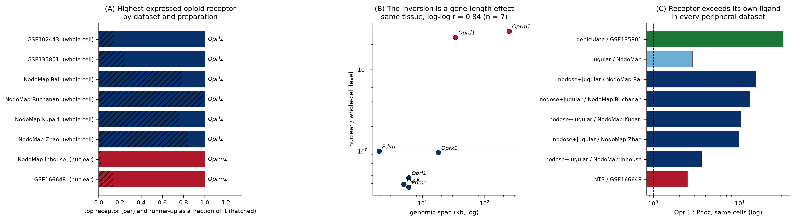

# The `Oprl1` signature across peripheral sensory ganglia

A cross-tissue synthesis of NOP receptor (`Oprl1`) and nociceptin precursor (`Pnoc`) expression
in mouse peripheral sensory neurons, combining two existing projects and adding the central
relay both ganglia project to.

| input | tissue | source |
|---|---|---|
| [PNOC-Nodose](https://github.com/AlexanderJais/PNOC-Nodose) | nodose and jugular ganglia | NodoMap atlas, 106,436 cells, 5 datasets |
| [Oprl1_Junhe](https://github.com/AlexanderJais/Oprl1_Junhe) | geniculate ganglion | GSE102443 (96 cells), GSE135801 (454 cells) |
| this repo | nucleus of the solitary tract | GSE166648, 49,392 neuronal nuclei |

Every number here is recomputed from the GEO source matrices through one pipeline. Nothing is
carried over from the summary tables of the two input projects.

---

## Results

### `Oprl1` is the highest-expressed opioid receptor of peripheral sensory neurons

Across two anatomically and functionally distinct ganglia, in six independently generated
whole-cell datasets, `Oprl1` ranks first among the four opioid receptors measured in the same
cells (`results/top_receptor_by_dataset.csv`):

| dataset | tissue | preparation | top receptor |
|---|---|---|---|
| GSE102443 | geniculate | whole cell | **`Oprl1`** |
| GSE135801 | geniculate | whole cell | **`Oprl1`** |
| NodoMap:Bai | nodose/jugular | whole cell | **`Oprl1`** |
| NodoMap:Buchanan | nodose/jugular | whole cell | **`Oprl1`** |
| NodoMap:Kupari | nodose/jugular | whole cell | **`Oprl1`** |
| NodoMap:Zhao | nodose/jugular | whole cell | **`Oprl1`** |
| NodoMap:inhouse | nodose/jugular | nuclear | `Oprm1` |
| GSE166648 | NTS (central) | nuclear | `Oprm1` |

Rank is the only receptor statistic compared across these datasets. The four receptors are
measured on the same cells with the same chemistry, so their ordering is informative even where
the absolute units (FPKM against CPM) are not.

### The two exceptions are an artefact of nuclear preparation, not a tissue difference

Both dissenting datasets are snRNA-seq, and both invert the ordering the same way. Within the
nodose ganglion, where whole-cell and nuclear data exist for the *same tissue*, the size of the
inversion tracks genomic span (`results/nuclear_bias_vs_gene_length.csv`):

| gene | genomic span | nuclear / whole-cell level |
|---|---|---|
| `Oprm1` | 250 kb | **29.0×** |
| `Oprd1` | 34 kb | **24.4×** |
| `Oprk1` | 18 kb | 0.95× |
| `Oprl1` | 6 kb | 0.47× |
| `Pomc` | 6 kb | 0.36× |
| `Penk` | 5 kb | 0.39× |
| `Pdyn` | 2 kb | 0.99× |

log-log Pearson *r* = 0.84 (n = 7 genes; Spearman rho = 0.58, *p* = 0.18, which is what seven
points can support). Nuclear preparations retain unspliced pre-mRNA, so long-intron genes gain
signal. `Oprm1` spans 250 kb against `Oprl1`'s 6 kb, and gains 29-fold.

**Opioid receptor ranking should not be read off snRNA-seq data.** This applies to the NTS
dataset here as much as to the nodose one, so this project makes no claim about a peripheral
against central receptor switch.



### Receptor without local ligand, in both ganglia

In every peripheral dataset `Oprl1` exceeds `Pnoc` in the same cells
(`results/ligand_receptor_by_tissue.csv`):

| tissue | dataset | `Oprl1` | `Pnoc` | ratio |
|---|---|---|---|---|
| geniculate | GSE135801 | 18.98 | 0.60 | **31.7×** |
| nodose | NodoMap:Bai | 11.84 | 0.77 | 15.4× |
| nodose | NodoMap:Buchanan | 9.59 | 0.73 | 13.2× |
| nodose | NodoMap:Kupari | 11.09 | 1.07 | 10.4× |
| nodose | NodoMap:Zhao | 11.98 | 1.23 | 9.7× |
| jugular | NodoMap (pooled) | 9.54 | 3.36 | 2.8× |

Both genes come from one matrix per row, so shared capture efficiency and shared depth cancel.
The jugular ganglion is the weakest case, at 2.8×, which is consistent with the focal `Pnoc`
population (JGN5, 11.1 % of cells) identified in the nodose project.

**The shared signature is therefore `Oprl1`-high, `Pnoc`-low, in neurons that carry the receptor
without making its ligand.** These afferents are positioned to receive nociceptin signalling
rather than to generate it.

### Where the ligand is made

NTS neurons carry 6.35 CPM `Pnoc` against 1.44 CPM in nodose neurons measured on the same
preparation type (4.4× higher; `results/nts_by_subtype.csv`). The signal concentrates in a small
glutamatergic population, Glu15 (n = 98, 40.0 CPM, 7.1 % of nuclei).

This is the weakest claim in the project and is stated as a hypothesis. It rests on one central
dataset, compares absolute levels across laboratories, and the nuclear-preparation confound
above applies. It is consistent with the receptor-without-ligand pattern having a central ligand
source, but does not establish it.

### `Penk` diverges sharply between the two ganglia

The one clear tissue difference. In the geniculate, `Penk` is among the most abundant transcripts
in the neurons themselves (166 FPKM, 97.6th percentile of expressed genes, GSE102443). In the
nodose and jugular ganglia it is **depleted** in neurons relative to other cells (log2 enrichment
−1.47), being largely a fibroblast transcript there (`results/nodose_neuron_enrichment.csv`).

So the opioid-peptide environment of the two ganglia is not shared, even though the receptor
profile is. Any model treating peripheral sensory ganglia as a single opioid compartment has to
accommodate this.

---

## Corrections to the input projects

Recomputing from source changed two things.

**`Pnoc` absence in the deep geniculate data is a reference gap, not a measured zero.** GSE102443
quantifies 17,111 genes and `Pnoc` is not among them, so the gene was never measured rather than
measured at zero. Other neuropeptides being present shows the annotation is not neuropeptide-poor
in general, but it does not make `Pnoc`'s absence evidence. The usable evidence for geniculate
`Pnoc` absence is GSE135801, where `Pnoc` **is** quantified and reads 0.60 CPM in 1 % of cells.
The conclusion stands; the supporting dataset changes.

**`Oprl1` dominance does hold in the nodose ganglion**, which a comparison of detection rates
obscures. On percent-of-cells-detected, `Oprl1` and `Oprm1` look comparable in the nodose data.
On expression level, `Oprl1` ranks first in all four whole-cell nodose datasets. Detection rate
saturates and is depth-sensitive; level is the statistic that transfers.

## Methods

Levels are pseudobulk means computed per dataset: FPKM for GSE102443, mean per-cell CPM
elsewhere. Transcript rows are summed to gene level. Detection percentages are recorded in the
per-tissue tables but are never compared across assays.

Three within-sample statistics carry all cross-tissue claims, in `src/atlas_common.py`:

- `receptor_rank()`, the ordering of the four receptors in one sample
- `ligand_receptor_ratio()`, `Oprl1` against `Pnoc` in the same cells
- `transcriptome_percentile()`, a gene's position in its own sample's expression distribution

Each dataset is checked against `Snap25`, `Phox2b`, `Slc17a6`, `Tac1`, `Calca` and `Actb` before
any opioid number is read from it.

The GSE166648 matrix is a dense genes-by-cells CSV that expands beyond the session's disk
allowance, so it is streamed once, retaining target gene rows and accumulating a per-gene total,
then cached.

## Reproducing

```bash
pip install -r requirements.txt
bash src/00_download_data.sh    # GEO matrices into data/raw/ (git-ignored)
python3 src/01_geniculate.py    # GSE102443 + GSE135801
python3 src/02_nodose.py        # NodoMap atlas (needs PNOC-Nodose data/ present)
python3 src/03_nts.py           # GSE166648, streamed and cached
python3 src/04_synthesis.py     # cross-tissue tables and Figure 1
```

`src/02_nodose.py` reads `/home/user/PNOC-Nodose/data/nodomap_integrated.h5ad`. Set
`NODOSE_ROOT` in `src/atlas_common.py` if that project lives elsewhere.

| file | contents |
|---|---|
| `geniculate_opioid_levels.csv` | 8 genes × 2 geniculate datasets, level and detection |
| `geniculate_receptor_rank.csv` | receptor ordering per geniculate dataset |
| `geniculate_per_cell_GSE102443.csv` | per-cell `Oprl1` FPKM, split gustatory/somatosensory |
| `nodose_opioid_levels.csv` | 8 genes × nodose, jugular, and each of the 5 datasets |
| `nodose_receptor_rank.csv` | receptor ordering, pooled and per dataset |
| `nodose_neuron_enrichment.csv` | neuron against non-neuron levels |
| `nts_opioid_levels.csv` | 8 genes in NTS neurons and non-neurons |
| `nts_by_subtype.csv` | `Pnoc`/`Oprl1` across NTS neuronal subtypes |
| `top_receptor_by_dataset.csv` | the ranking table above |
| `nuclear_bias_vs_gene_length.csv` | the gene-length analysis |
| `ligand_receptor_by_tissue.csv` | `Oprl1`:`Pnoc` per dataset |

## Provenance

- GSE102443 Dvoryanchikov et al. 2017, *Nat Commun*, 96 geniculate neurons, SMART-seq
- GSE135801 Zhang et al. 2019, *Cell* (Zuker lab), 454 Phox2b+ geniculate neurons
- GSE166648 Ludwig et al., dorsal vagal complex snRNA-seq, 72,128 nuclei
- NodoMap Cheng et al. 2026, *Cell Press Blue* 1:100072, via CZ CELLxGENE
