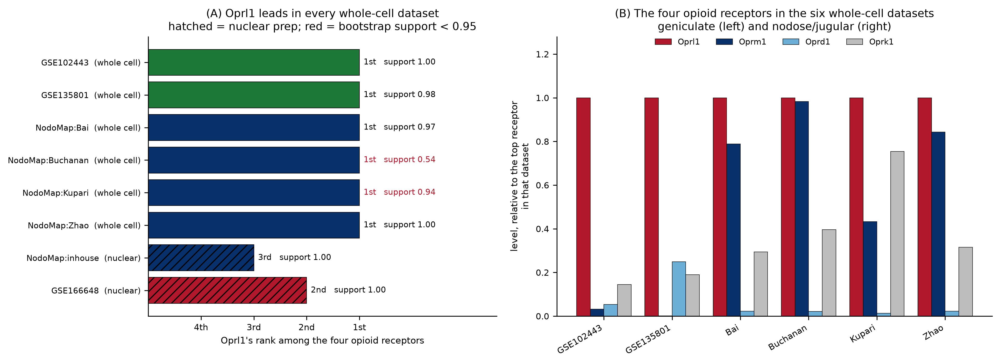
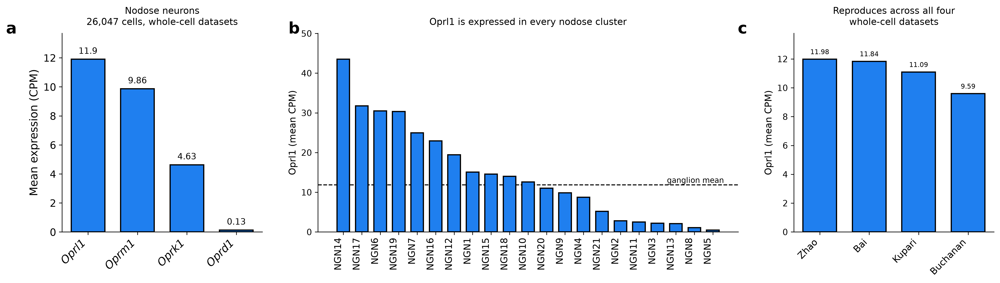
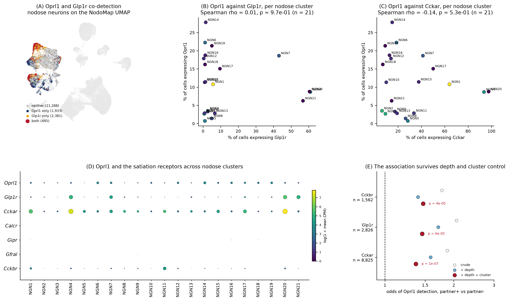
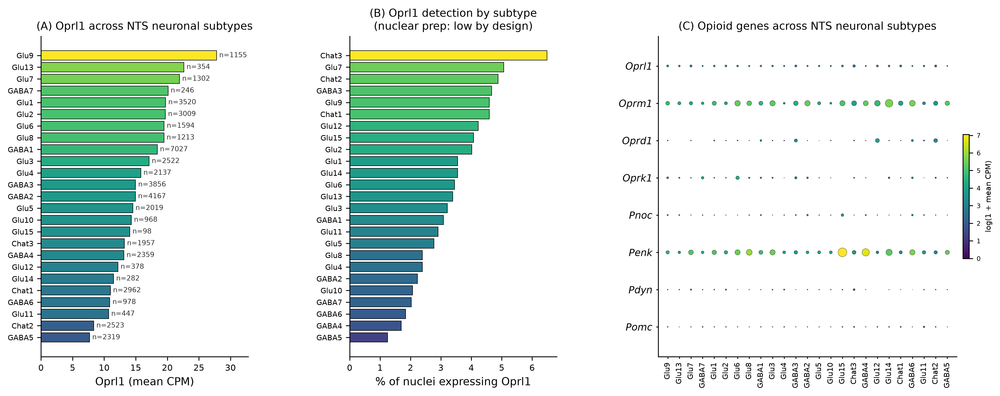

# `Oprl1` — the dominant opioid receptor of peripheral sensory neurons

The NOP receptor `Oprl1` is the highest-expressed opioid-family receptor in mouse peripheral
sensory ganglia, and it sits on the vagal afferents that carry the satiation receptors `Glp1r`
and `Cckar`.

| input | tissue | source |
|---|---|---|
| [PNOC-Nodose](https://github.com/AlexanderJais/PNOC-Nodose) | nodose and jugular ganglia | NodoMap atlas, 106,436 cells in 52 clusters, 5 datasets |
| [Oprl1_Junhe](https://github.com/AlexanderJais/Oprl1_Junhe) | geniculate ganglion | GSE102443 (96 cells), GSE135801 (454 cells) |
| this repo | nucleus of the solitary tract | GSE166648, 49,392 neuronal nuclei in 25 subtypes |

Every number is recomputed from the GEO and CELLxGENE source matrices through one pipeline.
Data-quality analyses live in [`SUPPLEMENT.md`](SUPPLEMENT.md); the full code audit is in
[`AUDIT.md`](AUDIT.md).

---

## 1. `Oprl1` is the highest-expressed opioid receptor, in both ganglia

In all six whole-cell datasets, across two anatomically and functionally distinct ganglia,
`Oprl1` ranks first among the four opioid receptors measured in the same cells
(`results/top_receptor_by_dataset.csv`).

`support` is the fraction of 2,000 cell bootstrap resamples in which the top receptor stays
top. It is reported because a 1.8 % lead and a 592 % lead are otherwise printed identically:

| dataset | tissue | `Oprl1` | runner-up | margin | bootstrap support |
|---|---|---|---|---|---|
| GSE102443 | geniculate | 5.73 FPKM | `Oprk1` 0.83 | **6.92×** | 1.00 |
| GSE135801 | geniculate | 18.98 CPM | `Oprd1` 4.72 | **4.02×** | 0.98 |
| NodoMap:Zhao | nodose/jugular | 11.98 CPM | `Oprm1` 10.11 | 1.19× | 1.00 |
| NodoMap:Bai | nodose/jugular | 11.84 CPM | `Oprm1` 9.33 | 1.27× | 0.97 |
| NodoMap:Kupari | nodose/jugular | 11.09 CPM | `Oprk1` 8.36 | 1.33× | 0.94 |
| NodoMap:Buchanan | nodose/jugular | 9.59 CPM | `Oprm1` 9.43 | 1.02× | **0.54** |

**The geniculate result is the strong one.** In the deep full-length data `Oprl1` is roughly an
order of magnitude above every other opioid receptor — 5.73 FPKM against `Oprk1` 0.83, `Oprd1`
0.31 and `Oprm1` 0.18 — and the ordering reproduces on an independent platform (GSE135801:
`Oprl1` 18.98 CPM against `Oprd1` 4.72, `Oprk1` 3.61, `Oprm1` 0.01).

**In the nodose the lead is real but narrow.** `Oprl1` is first in all four whole-cell nodose
datasets, but by 19–33 % rather than by an order of magnitude, and in Buchanan the margin is
1.8 % — an ordering that survives resampling only 54 % of the time and should be read as
"`Oprl1` and `Oprm1` are level", not as a fourth independent win.

Rank is the only receptor statistic compared across datasets: the four receptors are measured
on the same cells with the same chemistry, so their ordering transfers even where the absolute
units (FPKM against CPM) do not.



> The two single-nucleus datasets rank `Oprm1` first. That is a preparation artefact — nuclear
> preparations retain unspliced pre-mRNA and `Oprm1` spans 250 kb against `Oprl1`'s 6 kb — and
> is documented in [`SUPPLEMENT.md`](SUPPLEMENT.md#figure-s1--nuclear-preparation-inverts-the-opioid-receptor-ordering).
> They are excluded from the claim above.

## 2. `Oprl1` is expressed across the whole population, not by a subtype

**Geniculate.** Detected in 92 % of the 96 neurons in the deep dataset, at indistinguishable
levels in both divisions of the ganglion: gustatory (Phox2b+) 6.29 FPKM (n = 61),
somatosensory (Phox2b−) 4.77 FPKM (n = 35). It is pan-geniculate, not a subtype marker.


**Nodose and jugular.** Present in every one of the 26 neuronal clusters, from 27.7 % of cells
in NGN14 down to 0.8 % in NGN5, and near-absent from the non-neuronal compartment (log2
neuronal enrichment **+3.53**, comparable to `Oprk1` +3.49 and `Oprm1` +3.24, far above `Oprd1`
+1.62). The top clusters are NGN14 (43.5 CPM), NGN17 (31.7), NGN6 (30.5) and NGN19 (30.3).



## 3. `Oprl1` sits on the `Glp1r` and `Cckar` afferents

This is the result the project was built for.

The orexigenic effect of N/OFQ is well established — ICV nociceptin drives feeding and weight
gain, NOP knockouts eat less, the antagonist SB-612111 suppresses intake on a high-fat diet —
and that literature attributes it to hypothalamic sites. If Gi-coupled `Oprl1` is expressed by
the same nodose neurons that carry the excitatory satiation receptors `Glp1r` and `Cckar`, then
the NOP receptor is positioned as a cell-autonomous brake on the first synapse of the gut–brain
axis, upstream of anything hypothalamic, and on the same cells GLP-1 receptor agonists act on.

Whole-cell datasets, nodose neurons only (n = 26,047). `results/vagal_oprl1_coexpression.csv`:

| partner | partner+ cells | `Oprl1`+ among partner+ | `Oprl1`+ among partner− | crude OR | + depth | **+ depth + cluster** | *p* |
|---|---|---|---|---|---|---|---|
| `Glp1r` | 2,826 | **15.8 %** | 8.3 % | 2.06 | 1.71 | **1.46** | 6×10⁻⁵ |
| `Cckar` | 8,825 | **12.8 %** | 7.3 % | 1.88 | 1.58 | **1.37** | 1×10⁻⁷ |
| `Cckbr` | 1,562 | 14.6 % | 8.8 % | 1.78 | 1.40 | **1.47** | 4×10⁻⁵ |

**Two neurons of the same cluster, sequenced to the same depth: the one expressing `Glp1r` is
1.46× more likely to also express `Oprl1`.** The attenuation from 2.06 to 1.46 is the point of
the analysis — part of the crude association is capture depth, part is cluster composition, and
what survives both is a real within-cluster association.



**What this does not show.** `Oprl1` is not a marker of the satiation-receptor populations.
Across the 21 nodose clusters there is no correlation between the fraction expressing `Oprl1`
and the fraction expressing `Glp1r` (Spearman rho = 0.01, *p* = 0.97) or `Cckar` (rho = −0.14,
*p* = 0.53). The `Glp1r`-high clusters NGN20 and NGN21 are mid-range for `Oprl1`; the
`Oprl1`-high cluster NGN14 is `Glp1r`-low. The association is within clusters, not between
them.

**The defensible claim is therefore the narrow one:** a substantial minority of GLP-1R and
CCK-A vagal afferents co-express the NOP receptor — at least 15.8 % and 12.8 % by raw
co-detection, which are floors given droplet dropout — and they do so more often than their
same-cluster, same-depth neighbours. That is enough for the anatomical substrate of a
cell-autonomous brake to exist on these neurons. It is not evidence that the brake is engaged,
and this repository tests no functional prediction.

`Calcr` is not detected in a single nodose neuron here, and `Gfral` (5 cells) and `Gipr` (19)
are effectively absent, so no statement is made about them.

## 4. The central relay

`Oprl1` is expressed across all 25 NTS neuronal subtypes, highest in the glutamatergic Glu9
(27.8 CPM, n = 1,155), Glu13 (22.6) and Glu7 (21.9). GSE166648 is a nuclear preparation, so its
receptor *ordering* is not usable (see the supplement) and no peripheral-against-central
comparison is made; the per-subtype `Oprl1` distribution is unaffected by that caveat.



---

## Methods

Levels are pseudobulk means per dataset: FPKM for GSE102443, mean per-cell CPM elsewhere.
Transcript rows are summed to gene level, and a gene symbol on more than one annotation row has
its rows summed rather than truncated to the first. Detection percentages are compared only
within one dataset, never across assays.

Statistics, in `src/atlas_common.py`:

- `receptor_rank()` — the ordering of the four receptors in one sample. Reports
  `determinate = False` when every level is zero or the top two are tied.
- `bootstrap_receptor_support()` — the fraction of 2,000 cell resamples in which the observed
  top receptor stays top, plus a 95 % interval on the margin.
- `stratified_odds_ratio()` — Mantel-Haenszel odds ratio holding capture depth, and separately
  depth and cluster identity, fixed. Co-detection in droplet data is confounded by depth: a
  cell detecting any gene tends to detect more genes overall, so a raw overlap percentage shows
  an association whether or not one exists.
- `transcriptome_percentile()`, `leave_one_out_pearson()` — supporting statistics.

Each dataset passes `check_markers()` before any `Oprl1` number is read from it: `Snap25` and
`Actb` are enforced, the tissue-specific markers are recorded. Preparation type is read from
the NodoMap atlas's own `suspension_type` field and checked against the registry in
`atlas_common.DATASETS`.

Figures follow the idiom of the sibling PNOC-Nodose project (`src/atlas_style.py`).

## Reproducing

```bash
pip install -r requirements.txt
export NODOSE_ROOT=/path/to/PNOC-Nodose      # defaults to /home/user/PNOC-Nodose
bash src/00_download_data.sh                 # GEO + the NodoMap atlas, checksummed
python3 src/01_geniculate.py                 # GSE102443 + GSE135801
python3 src/02_nodose.py                     # NodoMap atlas
python3 src/03_nts.py                        # GSE166648, streamed and cached
python3 src/04_synthesis.py                  # cross-tissue ranking + Figure S1
python3 src/05_vagal_coexpression.py         # Oprl1 x Glp1r/Cckar
python3 -m pytest tests -q                   # 33 unit tests
```

| figure | contents |
|---|---|
| `figure1_geniculate_oprl1` | `Oprl1` per neuron by division, detection, opioid panel |
| `figure2_nodose_oprl1` | `Oprl1` on the published UMAP, across 26 neuronal clusters, by dataset |
| `figure3_vagal_oprl1_satiation` | `Oprl1` against `Glp1r`/`Cckar`: UMAP, per cluster, odds ratios |
| `figure4_nts_oprl1` | `Oprl1` across the 25 NTS neuronal subtypes |
| `figure5_oprl1_receptor_ranking` | `Oprl1` against the other three receptors, every dataset |
| `figureS1`, `figureS2` | supplementary — see [`SUPPLEMENT.md`](SUPPLEMENT.md) |

| table | contents |
|---|---|
| `vagal_oprl1_coexpression.csv` | co-detection and stratified odds ratios per partner gene |
| `vagal_oprl1_satiation_by_cluster.csv` | `Oprl1` and the satiation panel per nodose cluster |
| `vagal_cluster_level_correlation.csv` | cluster-level Spearman against each partner |
| `oprl1_across_datasets.csv` | `Oprl1`'s rank among the four receptors, per dataset |
| `top_receptor_by_dataset.csv` | top receptor per dataset, with bootstrap support |
| `nodose_oprl1_by_cluster.csv` | `Oprl1` level and detection in each of the 52 clusters |
| `nts_by_subtype.csv` | `Oprl1` across the 25 NTS neuronal subtypes |
| `geniculate_per_cell_GSE102443.csv` | per-cell `Oprl1` FPKM, split gustatory/somatosensory |
| `*_opioid_levels.csv`, `*_receptor_rank.csv`, `*_rank_support.csv` | per-tissue levels, ordering, support |

## Provenance

- GSE102443 Dvoryanchikov et al. 2017, *Nat Commun*, 96 geniculate neurons, SMART-seq
- GSE135801 Zhang et al. 2019, *Cell* (Zuker lab), 454 Phox2b+ geniculate neurons
- GSE166648 Ludwig et al., dorsal vagal complex snRNA-seq, 72,128 nuclei
- NodoMap Cheng et al. 2026, *Cell Press Blue* 1:100072, doi:10.1016/j.cpblue.2026.100072,
  via CZ CELLxGENE collection `982f9f44-031c-4c8c-91ee-dcaa53b10151`
