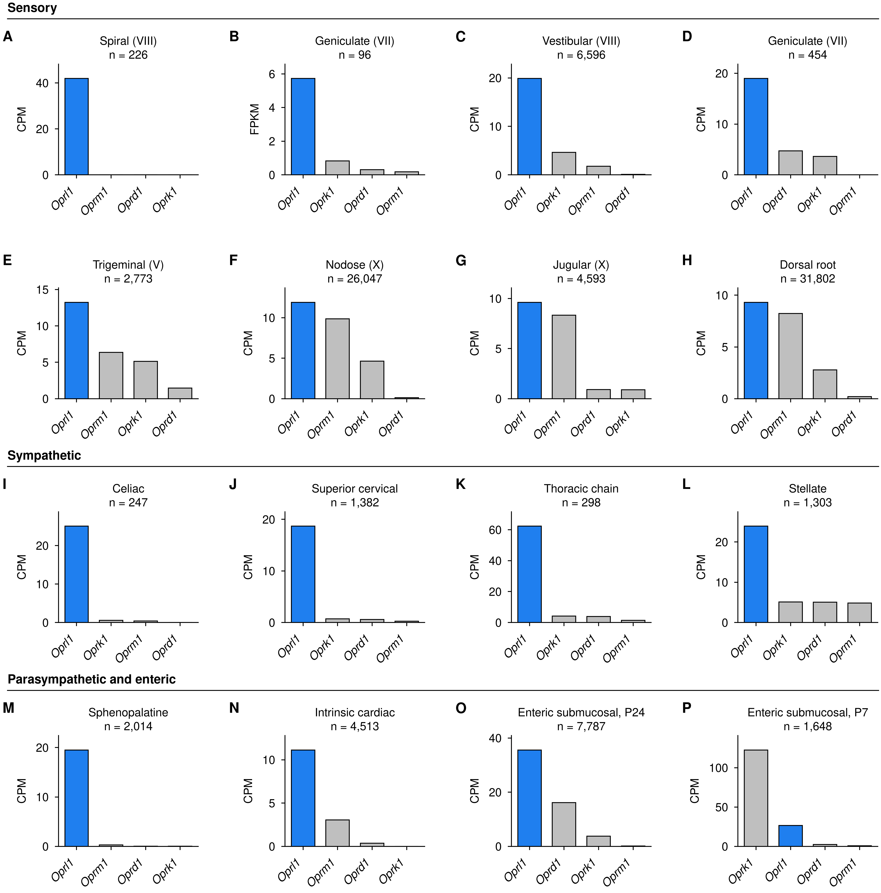
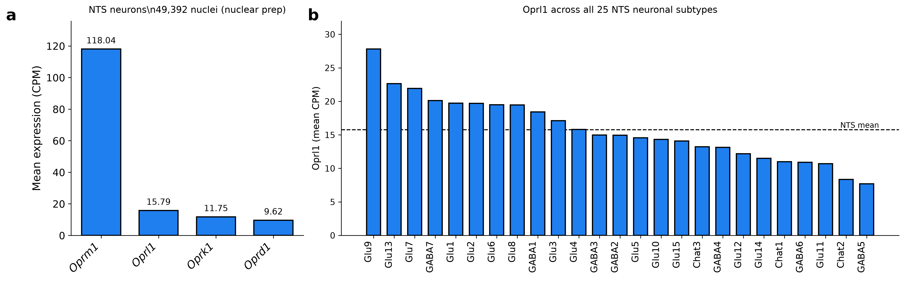

# *Oprl1* is the dominant opioid receptor of peripheral sensory neurons

In mouse geniculate ganglion neurons *Oprl1* is expressed 31-fold above *Oprm1* and is detected in
92% of cells. The ordering reproduces on a second platform from a second laboratory. It holds in
five ganglia spanning both developmental origins of the peripheral sensory system, including the
dorsal root ganglion, where most work on opioid receptors in sensory neurons has been done and
where that work targets *Oprm1*.

| input | tissue | source |
|---|---|---|
| [Oprl1_Junhe](https://github.com/AlexanderJais/Oprl1_Junhe) | geniculate ganglion | GSE102443 (96 cells), GSE135801 (454 cells) |
| [PNOC-Nodose](https://github.com/AlexanderJais/PNOC-Nodose) | nodose and jugular ganglia | NodoMap atlas, 106,436 cells in 52 clusters, 5 datasets |
| [iPain Atlas](https://cellxgene.cziscience.com/collections/03608e22-227a-4492-910b-3cb3f16f952e) | trigeminal and dorsal root ganglia | 84,658 and 191,798 cells |
| this repo | nucleus of the solitary tract | GSE166648, 49,392 neuronal nuclei in 25 subtypes |

Every number is recomputed from the GEO and CELLxGENE source matrices through one pipeline.
Data-quality analyses are in [`SUPPLEMENT.md`](SUPPLEMENT.md); the code audit is in
[`AUDIT.md`](AUDIT.md).

Both headline claims rest on the geniculate SMART-seq data, GSE102443, n = 96 neurons.
Full-length library preparation is what makes a 92% detection rate interpretable; droplet data
reaches that figure for no gene. The nodose droplet datasets agree with both claims without
independently establishing either, since their highest per-cluster detection rate is 27.7% and
that value is a platform ceiling. A single 96-cell experiment carries a large share of the
evidence. The replication that matters is GSE135801: different platform, different laboratory,
same ordering.

---

## 1. *Oprl1* is the highest-expressed opioid receptor in every ganglion measured

Mean expression of the four opioid receptors, measured in the same cells, in each dataset's own
unit (`results/*_opioid_levels.csv`):

| dataset | tissue | *Oprl1* | *Oprm1* | *Oprd1* | *Oprk1* | *Oprl1*:*Oprm1* |
|---|---|---|---|---|---|---|
| GSE114997 (CPM) | spiral (VIII) | 41.94 | 0.00 | 0.00 | 0.00 | only one detected |
| GSE102443 (FPKM) | geniculate | 5.73 | 0.18 | 0.31 | 0.83 | 31× |
| GSE135801 (CPM) | geniculate | 18.98 | 0.01 | 4.72 | 3.61 | large |
| NodoMap, nodose neurons (CPM) | nodose | 11.90 | 9.86 | 0.13 | 4.63 | 1.21× |
| NodoMap, jugular neurons (CPM) | jugular | 9.62 | 8.33 | 0.92 | 0.90 | 1.16× |
| iPain, trigeminal neurons (CPM) | trigeminal | 13.24 | 6.36 | 1.46 | 5.12 | 2.08× |
| iPain, DRG neurons (CPM) | dorsal root | 9.31 | 8.23 | 0.20 | 2.78 | 1.13× |
| GSE166648, NTS neurons (CPM) | NTS | 15.79 | 118.04 | 9.62 | 11.75 | 0.13× |

The geniculate result carries the claim. *Oprl1* at 5.73 FPKM against *Oprm1* at 0.18 is an
order-of-magnitude difference in transcript abundance rather than a difference in rank order, and
it reproduces in GSE135801 (*Oprl1* 18.98 CPM, *Oprm1* 0.01 CPM). *Oprm1* is the least abundant of
the four receptors in geniculate neurons.

The nodose data agrees at a much smaller margin. *Oprl1* is highest there at 11.90 CPM against
*Oprm1* 9.86, and comes first in each of the four whole-cell datasets separately (11.98, 11.84,
11.09, 9.59 CPM). Resampling the cells 2,000 times, that ordering holds in 100%, 97% and 94% of
resamples for Zhao, Bai and Kupari, and in 54% for Buchanan
(`results/*_rank_support.csv`). Buchanan gives an ordering indistinguishable from a tie. The four
nodose datasets corroborate the geniculate result; they do not constitute four independent
demonstrations of it.

The jugular ganglion marks the edge of the claim. Geniculate and nodose are epibranchial
placode-derived; the jugular is neural-crest-derived and sits in the same tissue block as the
nodose, so it tests whether the ordering follows developmental origin. Restricted to whole-cell
data, *Oprl1* leads there at 9.62 CPM against *Oprm1* 8.33, a margin of 1.16× with bootstrap
support 0.897 and a 95% interval on the margin of 0.92 to 1.47, which includes 1. Across the three
jugular datasets with enough cells, Kupari and Zhao place *Oprl1* first (support 0.99 and 0.81)
and Buchanan places *Oprm1* first at support 0.51. The crest ganglion agrees in direction at the
weakest margin measured in any peripheral dataset here.

The ordering holds in the two somatic ganglia. In the trigeminal ganglion *Oprl1* reaches 13.24
CPM against *Oprm1* 6.36, a margin of 2.08× with support 1.000 and a 95% interval of 1.41 to 3.26
(n = 2,773 whole-cell neurons). In the dorsal root ganglion *Oprl1* reaches 9.31 CPM against
*Oprm1* 8.23, a margin of 1.13× with support 1.000 and an interval of 1.08 to 1.19 that excludes 1
(n = 31,802 whole-cell neurons). The DRG margin is the narrowest measured here and the DRG sample
is the second largest.

The spiral ganglion gives the clearest case. In 226 neurons sequenced to a median depth of 2.7
million reads, *Oprl1* is detected in 74.8% of cells at 41.94 CPM and *Oprm1*, *Oprd1* and
*Oprk1* are detected in none. All four are present in the annotation, so those are measured zeros.
Depth is 730-fold above the nodose droplet median, which is what makes a zero interpretable. The
same neurons carry *Scn1a* at 310.2 CPM, *Pvalb* at 882.6 and *Scn10a* at 0.00, the Nav1.1
profile that section 3 predicts should be *Oprl1*-high.

One qualification applies to every row above. *Oprl1* dominates its receptor family without being
an abundant transcript. It sits at the 73.6th percentile of the 32,565 genes expressed in nodose
neurons and the 63.8th percentile in GSE102443, against *Trpv1* at the 95.3rd and *Scn10a* at the
96.1st in the same nodose cells. The claim is about the opioid receptor family, not about
transcript abundance in general.

*Oprm1* in the dorsal root ganglion is highest in the peptidergic nociceptor populations, PEP1 at
13.93 CPM and SST at 12.06, which is where the peripheral analgesia literature places it. The same
pipeline that reproduces that distribution places *Oprl1* above *Oprm1* across the ganglion as a
whole.

Both iPain atlases are majority single-nucleus (trigeminal 70,772 of 84,658, DRG 123,645 of
191,798), so every figure above is restricted to whole-cell cells. Pooling preparations compresses
the trigeminal margin from 2.08× to 1.18×.



The eight-dataset version of this comparison, including the two nuclear preparations, is figure S3
in [`SUPPLEMENT.md`](SUPPLEMENT.md).

The two single-nucleus datasets place *Oprm1* first. This is a preparation artefact: nuclear
preparations retain unspliced pre-mRNA and *Oprm1* spans 250 kb against *Oprl1*'s 6 kb. See
[`SUPPLEMENT.md`](SUPPLEMENT.md). Those datasets carry no claim here.

### Coverage of the peripheral sensory series

| ganglion | origin | status |
|---|---|---|
| geniculate (VII) | epibranchial placode | measured |
| nodose (X) | epibranchial placode | measured |
| jugular (X superior) | neural crest | measured |
| trigeminal (V) | crest and placode | measured |
| dorsal root ganglion | neural crest | measured |
| spiral (VIII) | otic placode | measured |
| vestibular (VIII) | otic placode | not measured |
| petrosal (IX) | epibranchial placode | no dataset exists |

The survey covers cranial visceral, gustatory, auditory and somatic afferents, and all three
developmental origins of the peripheral sensory system.

Petrosal has no dataset. A GEO search over expression profiling by high-throughput sequencing
returns one hit for the term, and that record is a geniculate study. The petrosal is normally
dissected as part of the nodose-petrosal-jugular complex and pooled, which is consistent with
finding none in isolation. Vestibular data exists (GSE309608, GSE226515, four and six mouse
samples) and has not been analysed here. The superior cervical ganglion, which would serve as a
sympathetic specificity control, returns nothing in CELLxGENE.

Human data is unavailable for a different reason. The CELLxGENE human DRG atlas (Nguyen et al.,
eLife 2021, 1,837 nuclei) quantifies 31,654 genes including *OPRM1*, *OPRD1* and *OPRK1*, and
*OPRL1* appears under neither symbol nor Ensembl identifier ENSG00000125510. That is a reference
gap rather than a measured zero, the same situation as *Pnoc* in GSE102443. The dataset is also
single-nucleus, which biases toward *OPRM1* for the reason in figure S1.

The trigeminal and DRG analyses are recorded in `results/EXTERNAL_GANGLIA_NOTES.md` and
`results/drg_oprl1_by_subtype.csv`. They are not yet wired into the numbered pipeline, so they do
not pass `check_markers`, the matched null or the ambient check that the other tissues do.

## 2. *Oprl1* is expressed in most neurons of the ganglion

In the geniculate, *Oprl1* is detected in 92% of the 96 neurons, at indistinguishable levels in
both divisions: gustatory (Phox2b+) 6.29 FPKM, n = 61; somatosensory (Phox2b-) 4.77 FPKM, n = 35
Expression is pan-geniculate.


This claim also rests on full-length data. A 92% detection rate is interpretable only on a
platform that can reach it. The droplet datasets reach 27.7% of cells in their highest cluster, so
they establish that *Oprl1* is present throughout the ganglion while leaving the per-neuron
fraction unresolved.

In the nodose and jugular ganglia, *Oprl1* appears in every one of the 26 neuronal clusters, from
27.7% of cells in NGN14 to 0.8% in NGN5, and is nearly absent from non-neuronal cells (log2
neuronal enrichment +3.53, against *Oprk1* +3.49, *Oprm1* +3.24 and *Oprd1* +1.62). The highest
clusters are NGN14 at 43.5 CPM, NGN17 at 31.7, NGN6 at 30.5 and NGN19 at 30.3.


## 3. Expression is graded by sodium channel class, in the vagus and the DRG

This gradient sits inside a gene expressed throughout the ganglion, and the effect is small
relative to sections 1 and 2. It was established in the vagus and then tested in the dorsal root
ganglion as a prediction.

Each NodoMap annotation is a property of the cluster, so the unit of analysis is the 21 nodose
clusters. Effect sizes below are cluster means, computed on the same basis as the test. An earlier
draft quoted cell-weighted ratios beside cluster-mean *p* values, which raised the fibre-type
effect from 2.7× to 5.1×.

| annotation | cluster-mean, high vs low | groups | *p* | Bonferroni (×4) |
|---|---|---|---|---|
| sodium channel | Nav1.1 / Nav1.8 = 4.02× | 9 / 11 | 0.00095 | 0.0038 |
| fibre type | myelinated / unmyelinated = 2.68× | 4 / 8 / 9 | 0.021 | 0.082 |
| sensor type | mechanosensor / nocisensor | 9 / 8 / 4 | 0.109 | 0.44 |
| organ projection | gut 17.56 vs broad 11.76 | 8 / 9 | 0.336 | 1.0 |

The sodium channel split is the only one that survives. Fibre type fails Bonferroni correction
across the four annotations tested, and its effect halves when computed on the same basis as its
own *p* value.

Fibre type is a proxy for sodium channel class. Cross-stratifying the two separates them
(`results/nodose_nav_fibre_crosstab.csv`):

| | myelinated | lightly myelinated | unmyelinated |
|---|---|---|---|
| Nav1.1 | 23.01 (n=3) | 25.60 (n=5) | 30.60 (n=1) |
| Nav1.8 | 12.88 (n=1) | 9.01 (n=2) | 4.78 (n=8) |

Sodium channel class holds inside every fibre stratum, at 1.8×, 2.8× and 6.4×. Fibre type inside
Nav1.1 is flat to reversed, with the single unmyelinated Nav1.1 cluster the highest of the nine.
The one fibre ordering sits in the Nav1.8 row and rests on n = 1 and n = 2. Myelination is
therefore dropped from every claim in this document.

The result is robust to the one ambiguous cluster. NGN18 is annotated Nav1.1/Nav1.8; *p* = 0.00095
with it excluded, 0.00072 assigned to Nav1.1, 0.00084 assigned to Nav1.8.

Four clusters show this more directly than the statistics do:

| cluster | n | CPM | Nav | fibre | sensor |
|---|---|---|---|---|---|
| NGN14 | 730 | 44.15 | Nav1.1 | myelinated | mechanosensor |
| NGN19 | 220 | 30.60 | Nav1.1 | unmyelinated | nocisensor |
| NGN1 | 4,370 | 15.17 | Nav1.8 | lightly myelinated | nocisensor |
| NGN21 | 192 | 5.28 | Nav1.1 | myelinated | mechanosensor |

NGN19 is an unmyelinated nociceptor and ranks 4th of 21. NGN21 is a myelinated Nav1.1
mechanosensor and ranks 17th. NGN1 is Nav1.8 and exceeds five of the nine Nav1.1 clusters. Sodium
channel class separates these four; myelination and sensor type do not.

The split also holds per cell against a matched null. Holding cluster and capture depth fixed, a
neuron expressing *Scn1a* is 1.72× more likely to express *Oprl1*, against a null of
expression-matched genes with median 1.36 (empirical *p* = 0.0099). *Scn10a* is 1.06 against a
null of 1.27, below chance.

The gradient is specific to *Oprl1* rather than a consequence of soma size. *Oprl1* CPM and
detection rate correlate at rho = 0.95 across clusters, so a cluster gradient could reflect total
RNA content. Testing 550 expression-matched genes for the same Nav1.1/Nav1.8 cluster ratio
(`results/nav_gradient_matched_null.csv`) gives a matched median of 1.11 against *Oprl1*'s 4.02,
with *Oprl1* exceeding 95.8% of them. The effect is solid at the 96th percentile.

The association replicates in the dorsal root ganglion, against a prediction made before that
data was obtained. Proprioceptors are the most Nav1.1-dependent sensory population known, so if
*Oprl1* tracks Nav1.1 generally they should rank near the top of *Oprl1* expression. The
proprioceptor population in the iPain atlas is NF2, which ranks first of nine whole-cell subtypes
for *Pvalb* (1,576 CPM), *Runx3* (86.9) and *Scn1a* (226.4). It ranks first for *Oprl1* as well, at
29.97 CPM. *Oprm1* ranks seventh of nine in the same population. Across the nine subtypes
(`results/drg_oprl1_by_subtype.csv`):

| partner | Spearman rho with *Oprl1* | *p* |
|---|---|---|
| *Scn1a* | +0.862 | 0.0028 |
| *Runx3* | +0.837 | 0.0049 |
| *Pvalb* | +0.817 | 0.0072 |
| *Ntrk3* | +0.550 | 0.125 |
| *Scn10a* | -0.700 | 0.036 |
| *Oprm1* | -0.183 | 0.637 |

Both directions of the nodose result appear again: positive with *Scn1a*, negative with *Scn10a*,
in a ganglion of different developmental origin and different modality.


The four nodose clusters that separate sodium channel class from fibre type, and the annotation
and transcriptome-wide panels behind this section, are figures S5 and S6 in
[`SUPPLEMENT.md`](SUPPLEMENT.md).

Nav1.1 supports high-frequency firing. *Oprl1* couples to Gi. Their co-occurrence identifies
neurons in which a Gi-coupled receptor is positioned to reduce firing in cells equipped to fire
rapidly. This description requires no projection target and no fibre class, and it applies to the
geniculate as readily as to the vagus.

Organ projection is descriptive. The *p* = 0.336 above compares the only two levels with more than
one cluster, gut (n = 8) against broad projection (n = 9), over 17 clusters. Duodenum, heart,
jejunum/ileum and pancreas contain one cluster each and were excluded from the test. An earlier
draft printed "pancreas 25.2 vs jejunum/ileum 5.3" beside that *p* value; those are NGN7 and
NGN21, one cluster against one cluster, from levels the test excluded. The pancreas figure is one
cluster's annotation in another laboratory's atlas and supports a retrograde-tracing experiment
and nothing further.

The transcriptome-wide correlate list carries a contamination component. All 54,640 genes were
correlated with *Oprl1* across the 21 clusters, and 2,149 of 16,380 expressed genes reach FDR
below 5%. NodoMap contains roughly 50,000 satellite and myelinating glia, and this pipeline
applies no ambient-RNA correction. Scoring the top 50 correlates against the glial compartment of
the same ganglion places 20 of 50 at higher abundance in glia than in nodose neurons.

*Adgrg6*/*Gpr126* is the clearest case and was previously cited here as supporting evidence. It is
8-fold more abundant in glia (log2 = -2.98). It is the Schwann-cell myelination receptor, and its
position at the top of the list reflects ambient RNA rather than neuronal identity. That citation
is withdrawn, along with *Col1a2* (-4.46), *Hmgcs2* (-3.58) and *Ptn* (-2.66). The neuronally
enriched correlates are *Cacng5* (+3.38), *Brinp1* (+2.79), *Atp1b1* (+2.78), *Eya4* (+2.29),
*Chgb* (+1.98) and *Rph3a* (+1.36). *Oprl1* itself is +3.48, so the gene of interest is unaffected.

## 4. *Oprl1* shows no association with *Glp1r* or *Cckar*

This project began by testing whether *Oprl1* occupies the *Glp1r* and *Cckar* afferents, which
would place a Gi-coupled receptor on the first synapse of the gut-brain axis. The data rejects
that arrangement at both levels of analysis.

Across the 21 nodose clusters, *Glp1r* ranks 8,461 of 16,380 genes by correlation with *Oprl1*
(rho = +0.13, *q* = 0.74), *Cckbr* ranks 8,828 (+0.11) and *Cckar* ranks 11,270 (-0.06). All three
sit near the middle of the distribution.

At the cell level the apparent association is at chance. An earlier draft reported a surviving
1.46× odds ratio for *Glp1r* after stratifying on cluster and capture depth, without a benchmark.
Number of detected features is not cell size, and *Oprl1* is a comparatively high expresser in
large, transcriptionally active neurons, so within a cluster it yields a positive odds ratio
against most moderately expressed genes. Running the identical statistic against 100 control genes
matched on detection rate and mean expression:

| partner | observed OR | matched-null median | null 95% | empirical *p* | position |
|---|---|---|---|---|---|
| *Scn1a* (Nav1.1) | 1.72 | 1.36 | 1.02-1.58 | 0.0099 | above null |
| *Cckbr* | 1.47 | 1.36 | 0.98-1.73 | 0.29 | at chance |
| *Glp1r* | 1.46 | 1.26 | 0.95-1.64 | 0.20 | at chance |
| *Cckar* | 1.37 | 1.13 | 0.87-1.90 | 0.42 | at chance |
| *Piezo2* | 1.32 | 1.19 | 0.73-1.71 | 0.35 | at chance |
| *Scn10a* (Nav1.8) | 1.06 | 1.27 | 1.00-1.56 | 0.90 | below null |
| *Trpv1* | 0.84 | 1.27 | 1.04-1.52 | - | below null |

The null median falls between 1.13 and 1.36. Values in the 1.3 to 1.5 band match what an
expression-matched random gene produces. *Glp1r*, *Cckar* and *Cckbr* are at chance, and the
data provides no support for *Oprl1* occupying the satiation-receptor populations.


The co-expression table contains an internal comparator. After full adjustment *Cckbr* scores
highest of the three testable partners at 1.47, against *Glp1r* 1.46 and *Cckar* 1.37, a spread of
0.10. *Cckbr* is the gastrin/CCK-B receptor and has no role in vagal satiation signalling
comparable to the other two. Its position at the top of the three indicates that the residual
value near 1.4 is a floor set by abundance.

Two results survive the control: *Scn1a* above its null, and *Trpv1* and *Scn10a* below theirs.
*Oprl1* is depleted from the nociceptor population.

## 5. Mechanotransduction and Gi effector genes

Section 3 predicts that N/OFQ acting on the vagus would reduce firing in Nav1.1 neurons. Three
conditions would have to hold on the same cells: the mechanotransducer *Piezo2*, the Gi effector
genes a NOP receptor signals through (*Kcnj3/6/9*, *Gnai*, *Gnao*, *Cacna1b*), and the absence of
the nociceptor programme as an internal negative control.


The negative control behaves as required. The nociceptor programme runs against *Oprl1* across
clusters, with *Trpa1* rho = -0.68, *Trpv1* -0.66 and *Scn10a* -0.63, all *q* below 0.03, and
*Trpv1* falls below the matched null per cell. Two independent routes place *Oprl1* on Nav1.1
neurons and away from the nociceptor population.

*Piezo2* does not meet the condition. Cluster-level rho = 0.34 (*q* = 0.31), and per cell the odds
ratio is 1.32 against a matched null of 1.19. An earlier draft reported 2.00; that figure came
from depth deciles computed over the whole atlas rather than within the nodose neurons under
analysis, and it is retracted. The stratum-granularity table
(`results/vagal_or_stratum_stability.csv`) accounts for the difference: every odds ratio here
rises as the stratification coarsens, and *Piezo2* reads 1.32 at cluster by depth-tercile, 1.53 at
cluster by depth-median and 2.40 at cluster only. The 2.00 was an under-adjusted estimate of the
same quantity.

The Gi effector genes divide. *Kcnj9* tracks *Oprl1* (rho = 0.68, *q* = 0.015) while the G-protein
subunits run against it, with *Gnai2* at -0.75, *Gnao1* at -0.65 and *Cacna1b* at -0.52. The data
does not establish co-expression of *Oprl1* with the effector genes.

The experiment that would settle this applies N/OFQ to vagal afferents and measures the
mechanically evoked response: gastric or intestinal distension with nodose recording, wild-type
against NOP knockout, or *ex vivo* with SB-612111.

A convergent version of the clinical hypothesis remains open and requires no co-expression.
GLP-1 receptor agonists act substantially by slowing gastric emptying, which raises distension and
mechanoreceptor firing. N/OFQ that reduces mechanoreceptor firing would lower GLP-1RA efficacy by
acting on a separate population whose output converges on the same afferent volley. This
arrangement is consistent with everything measured here and is testable in the same *ex vivo*
preparation.

## 6. The geniculate result concerns taste, and conflicts with existing behaviour data

The strongest finding in this document, 5.73 against 0.18 FPKM in 92% of neurons across both
divisions, is in the gustatory ganglion. NOP-knockout mice show unchanged taste reactivity to
sucrose, and the reported diet-preference effects were argued to be independent of orosensory
properties. A receptor at this abundance with no reported gustatory phenotype requires an
explanation. Either the behavioural assays lack the resolution for what *Oprl1* does in these
neurons, or *Oprl1* serves a function other than modulating taste transmission: trophic support,
axonal excitability, or action on the somatosensory rather than the gustatory division. This
repository cannot distinguish these possibilities.

## 7. *Oprl1* in the nucleus of the solitary tract

*Oprl1* is expressed across all 25 NTS neuronal subtypes, highest in the glutamatergic Glu9 at
27.8 CPM (n = 1,155), Glu13 at 22.6 and Glu7 at 21.9. GSE166648 is a nuclear preparation, so the
receptor ordering within it is unusable and no peripheral-to-central comparison is made. The
per-subtype distribution is unaffected by that limitation.



---

## Methods

Levels are pseudobulk means per dataset: FPKM for GSE102443, mean per-cell CPM elsewhere.
Transcript rows are summed to gene level, and a gene symbol appearing on more than one annotation
row has its rows summed. Detection percentages are compared within one dataset only.

Statistics are in `src/atlas_common.py`:

- `receptor_rank()` orders the four receptors in one sample and reports `determinate = False` when
  every level is zero or the top two are tied.
- `bootstrap_receptor_support()` gives the fraction of 2,000 cell resamples in which the observed
  top receptor stays top, with a 95% interval on the margin.
- `stratified_odds_ratio()` computes a Mantel-Haenszel odds ratio holding capture depth fixed, and
  separately depth and cluster identity. Co-detection in droplet data is confounded by depth: a
  cell detecting one gene tends to detect more genes overall, so a raw overlap percentage produces
  an association independently of any biological one.
- `cluster_depth_strata()` builds the stratum label. Depth quantiles are computed over the cells
  under analysis, since quantiles set by a population including glia do not describe the neurons.
- `transcriptome_percentile()` and `leave_one_out_pearson()` support the sections above.

Each dataset passes `check_markers()` before any *Oprl1* number is read from it. *Snap25* and
*Actb* are enforced; the tissue-specific markers are recorded. Preparation type is read from the
NodoMap `suspension_type` field and checked against the registry in `atlas_common.DATASETS`.

Figures follow the conventions of the sibling PNOC-Nodose project (`src/atlas_style.py`).

## Reproducing

```bash
pip install -r requirements.txt
export NODOSE_ROOT=/path/to/PNOC-Nodose      # defaults to /home/user/PNOC-Nodose
bash src/00_download_data.sh                 # GEO + the NodoMap atlas, checksummed
python3 src/01_geniculate.py                 # GSE102443 + GSE135801
python3 src/02_nodose.py                     # NodoMap atlas
python3 src/03_nts.py                        # GSE166648, streamed and cached
python3 src/04_synthesis.py                  # cross-tissue comparison + figure S1
python3 src/05_vagal_coexpression.py         # Oprl1 against Glp1r and Cckar
python3 src/06_oprl1_localisation.py         # annotations and transcriptome-wide correlation
python3 src/07_transduction_effector_genes.py       # Piezo2, Gi effectors, nociceptor control
python3 src/08_specificity_controls.py       # matched nulls, group sizes, ambient check
python3 src/09_main_figures.py               # consolidated figures 1 and 3
python3 -m pytest tests -q                   # 33 unit tests
```

| figure | contents |
|---|---|
| `figure1_oprl1_across_ganglia` | the four receptors in each of the five ganglia measured |
| `figure2_geniculate_oprl1` | per-neuron *Oprl1* in both geniculate divisions |
| `figure2b_nodose_oprl1` | *Oprl1* across the 21 nodose clusters and the four datasets |
| `figure3_sodium_channel_gradient` | the Nav gradient in the nodose and the DRG proprioceptor test |
| `figure4_vagal_oprl1_satiation` | *Oprl1* against *Glp1r* and *Cckar* |
| `figure5_nts_oprl1` | *Oprl1* in NTS neurons and across the 25 subtypes |
| `figure6_transduction_effector_genes` | *Piezo2*, the Gi effector genes, the nociceptor control |
| `figureS1`-`figureS6` | see [`SUPPLEMENT.md`](SUPPLEMENT.md) |

| table | contents |
|---|---|
| `receptor_levels_by_ganglion.csv` | the figure 1 table, five ganglia |
| `EXTERNAL_GANGLIA_NOTES.md` | trigeminal and DRG receptor levels, and the proprioceptor test |
| `drg_oprl1_by_subtype.csv` | *Oprl1* and Nav markers across the 9 DRG neuronal subtypes |
| `nodose_oprl1_by_cluster_annotated.csv` | per-cluster *Oprl1* with the atlas annotations |
| `nodose_oprl1_annotation_tests.csv` | Kruskal-Wallis over cluster means, per annotation |
| `nodose_nav_fibre_crosstab.csv` | Nav class cross-stratified against fibre type |
| `nav_gradient_matched_null.csv` | the Nav1.1/Nav1.8 cluster gradient against 550 matched genes |
| `vagal_or_matched_null.csv` | every odds ratio against ~100 expression-matched control genes |
| `vagal_or_stratum_stability.csv` | every odds ratio at three stratum granularities |
| `nodose_top_correlates_ambient_check.csv` | top correlates scored neuron against glia |
| `nodose_annotation_group_sizes.csv` | clusters per annotation level |
| `nodose_oprl1_gene_correlations.csv` | every expressed gene correlated with *Oprl1* |
| `vagal_oprl1_coexpression.csv` | co-detection and stratified odds ratios per partner |
| `vagal_piezo2_oprl1_coexpression.csv` | *Piezo2* and *Oprl1* co-detection, stratified |
| `vagal_gene_module_correlations.csv` | *Oprl1* against the three gene modules |
| `vagal_oprl1_satiation_by_cluster.csv` | *Oprl1* and the satiation panel per cluster |
| `vagal_cluster_level_correlation.csv` | cluster-level Spearman against each partner |
| `nodose_oprl1_by_annotation.csv` | *Oprl1* by organ, fibre type, sensor type, Nav class |
| `nodose_oprl1_by_cluster.csv` | *Oprl1* level and detection in each of the 52 clusters |
| `oprl1_across_datasets.csv` | *Oprl1* position among the four receptors, per dataset |
| `top_receptor_by_dataset.csv` | top receptor per dataset, with bootstrap support |
| `nts_by_subtype.csv` | *Oprl1* across the 25 NTS neuronal subtypes |
| `geniculate_per_cell_GSE102443.csv` | per-cell *Oprl1* FPKM, split gustatory/somatosensory |
| `*_opioid_levels.csv`, `*_receptor_rank.csv`, `*_rank_support.csv` | per-tissue levels, ordering, support |

## Provenance

- GSE102443 Dvoryanchikov et al. 2017, *Nat Commun*, 96 geniculate neurons, SMART-seq
- GSE135801 Zhang et al. 2019, *Cell* (Zuker lab), 454 Phox2b+ geniculate neurons
- GSE166648 Ludwig et al., dorsal vagal complex snRNA-seq, 72,128 nuclei
- GSE114997 Shrestha et al. 2018, *Cell*, 226 spiral ganglion neurons, SMART-seq
- iPain Atlas, mouse trigeminal (84,658 cells) and dorsal root ganglion (191,798 cells), via CZ
  CELLxGENE collection `03608e22-227a-4492-910b-3cb3f16f952e`
- NodoMap Cheng et al. 2026, *Cell Press Blue* 1:100072, doi:10.1016/j.cpblue.2026.100072,
  via CZ CELLxGENE collection `982f9f44-031c-4c8c-91ee-dcaa53b10151`
