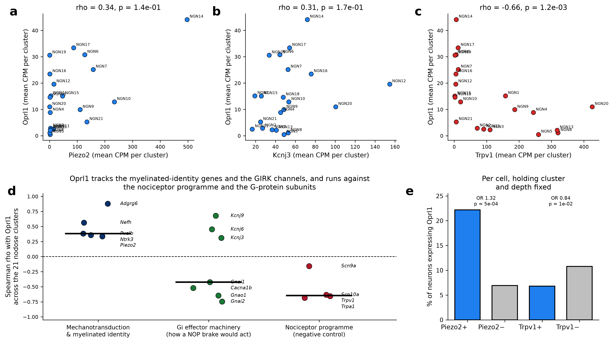

# The opioid receptor of peripheral sensory neurons is `Oprl1`, not `Oprm1`

The field's working model of opioid signalling in sensory ganglia is `Oprm1` — that is where the
peripheral analgesia effort goes. In mouse geniculate ganglion neurons `Oprl1` is expressed
**31× higher than `Oprm1`**, in nearly every neuron, and the same ordering appears on a second
platform from a second laboratory. The receptor actually positioned to modulate peripheral
sensory transmission is the one nobody targets peripherally.

| input | tissue | source |
|---|---|---|
| [Oprl1_Junhe](https://github.com/AlexanderJais/Oprl1_Junhe) | geniculate ganglion | GSE102443 (96 cells), GSE135801 (454 cells) |
| [PNOC-Nodose](https://github.com/AlexanderJais/PNOC-Nodose) | nodose and jugular ganglia | NodoMap atlas, 106,436 cells in 52 clusters, 5 datasets |
| this repo | nucleus of the solitary tract | GSE166648, 49,392 neuronal nuclei in 25 subtypes |

Every number is recomputed from the GEO and CELLxGENE source matrices through one pipeline.
Data-quality analyses live in [`SUPPLEMENT.md`](SUPPLEMENT.md); the full code audit is in
[`AUDIT.md`](AUDIT.md).

> **Which data carries which claim.** Both headline claims — dominance and pan-neuronal
> expression — rest on the geniculate SMART-seq data (GSE102443, **n = 96 neurons**). Full-length
> library preparation is what makes a 92 % detection rate credible; the droplet data cannot
> produce that number for any gene. The nodose droplet datasets are **consistent** with both
> claims and do not independently confirm either: their best per-cluster detection rate is 27.7 %,
> which is a platform ceiling rather than a biological one. A single 96-cell experiment is doing
> a lot of work here, and the replication that matters is GSE135801 — different platform,
> different laboratory, same ordering.

---

## 1. `Oprl1` is the dominant opioid receptor of sensory ganglion neurons

Mean expression of the four opioid-family receptors, measured in the same cells, in each
dataset's own unit (`results/*_opioid_levels.csv`):

| dataset | tissue | `Oprl1` | `Oprm1` | `Oprd1` | `Oprk1` | `Oprl1`:`Oprm1` |
|---|---|---|---|---|---|---|
| GSE102443 (FPKM) | geniculate | **5.73** | 0.18 | 0.31 | 0.83 | **31×** |
| GSE135801 (CPM) | geniculate | **18.98** | 0.01 | 4.72 | 3.61 | large |
| NodoMap, nodose neurons (CPM) | nodose | **11.90** | 9.86 | 0.13 | 4.63 | 1.2× |
| GSE166648, NTS neurons (CPM) | NTS | 15.79 | 118.04 | 9.62 | 11.75 | — |

**The geniculate result is the claim.** `Oprl1` at 5.73 FPKM against `Oprm1` at 0.18 is a 31-fold
margin — not a ranking, an order-of-magnitude difference in transcript abundance — and it
reproduces on an independent platform in an independent laboratory (GSE135801: `Oprl1` 18.98 CPM,
`Oprm1` 0.01 CPM). `Oprm1`, the receptor the peripheral opioid literature is built on, is the
*least* abundant of the four in these neurons.


**The nodose data is consistent, not confirmatory.** `Oprl1` is highest there too (11.90 CPM
against `Oprm1` 9.86), and it comes out first in each of the four whole-cell datasets separately
(11.98, 11.84, 11.09, 9.59 CPM). But the margin is 1.2× rather than 31×, and resampling the cells
2,000 times it holds in 100 %, 97 % and 94 % of resamples for Zhao, Bai and Kupari and in only
54 % for Buchanan (`results/*_rank_support.csv`). Read the nodose datasets as agreeing with the
geniculate result, not as four more independent wins.


The eight-dataset version of this comparison is [`figureS3`](SUPPLEMENT.md).

> The two single-nucleus datasets put `Oprm1` first. That is a preparation artefact — nuclear
> preparations retain unspliced pre-mRNA and `Oprm1` spans 250 kb against `Oprl1`'s 6 kb — and
> is documented in [`SUPPLEMENT.md`](SUPPLEMENT.md). They carry no claim here.

## 2. It is pan-neuronal, not a subtype marker

**Geniculate.** Detected in **92 % of the 96 neurons** in the deep dataset, at indistinguishable
levels in both divisions of the ganglion: gustatory (Phox2b+) 6.29 FPKM (n = 61),
somatosensory (Phox2b−) 4.77 FPKM (n = 35) — figure 1b. It is pan-geniculate.

This is the second claim that rests on full-length data. A 92 % detection rate is only
interpretable on a platform that can reach it; the droplet datasets top out at 27.7 % of cells in
their best cluster, so they can show that `Oprl1` is everywhere but not that it is in almost
every neuron.

**Nodose and jugular.** Present in every one of the 26 neuronal clusters, from 27.7 % of cells
in NGN14 down to 0.8 % in NGN5, and near-absent from the non-neuronal compartment (log2
neuronal enrichment **+3.53**, comparable to `Oprk1` +3.49 and `Oprm1` +3.24, far above `Oprd1`
+1.62). The top clusters are NGN14 (43.5 CPM), NGN17 (31.7), NGN6 (30.5) and NGN19 (30.3) —
figure 2b.

## 3. Within the vagus, `Oprl1` tracks the Nav1.1+ myelinated afferents

This is a gradient within a gene that is expressed everywhere, and it is a much smaller effect
than sections 1 and 2. It is figure 3, not the headline.

Each NodoMap annotation is a property of the **cluster**, not the cell, so the unit of analysis
is the 21 nodose clusters (`results/nodose_oprl1_annotation_tests.csv`;
`results/nodose_annotation_group_sizes.csv` gives the group sizes, which are not lopsided —
Nav1.8 n = 11 against Nav1.1 n = 9, and myelinated/lightly/unmyelinated 4/8/9):

| annotation | mean CPM, high vs low | groups | *p* (n = 21 clusters) |
|---|---|---|---|
| **sodium channel** | Nav1.1 **27.0** vs Nav1.8 **6.8** | 9 / 11 | **0.0010** |
| **fibre type** | Myelinated **23.1** vs Unmyelinated **4.5** | 4 / 8 / 9 | **0.021** |
| sensor type | Mechanosensor 18.7 vs Nocisensor 9.3 | 9 / 8 / 4 | 0.109 |
| organ projection | Pancreas 25.2 vs Jejunum/Ileum 5.3 | 9 / 8 / 1 / 1 / 1 / 1 | 0.336 |

**The Nav-class split also survives per cell**, which is the test that killed most of section 4.
Holding cluster identity and capture depth fixed, a nodose neuron expressing `Scn1a` (Nav1.1) is
**1.72×** more likely to express `Oprl1` — against a null of expression-matched genes with median
1.36, empirical *p* = **0.0099** (`results/vagal_or_matched_null.csv`). `Scn10a` (Nav1.8) sits at
1.06 against a null of 1.27, i.e. below chance. The A-fibre association is real and the C-fibre
one is a genuine depletion.

**Organ projection is descriptive only, and the pancreas number is n = 1.** Four of its six
levels contain a single cluster. Pancreas 25.2 CPM rests on one cluster's annotation in someone
else's atlas — not tracing, not a replicated cluster. It is a hypothesis for a retrograde-tracing
experiment and nothing should be built on it.


**The transcriptome-wide correlate list needs a warning.** All 54,640 genes were correlated with
`Oprl1` across the 21 clusters and 2,149 of 16,380 expressed genes reach FDR < 5 %. But NodoMap
contains ~50,000 satellite and myelinating glia and this pipeline applies **no ambient-RNA
correction** (no CellBender, SoupX or decontX). Scoring the top 50 correlates against the glial
compartment of the same ganglion (`results/nodose_top_correlates_ambient_check.csv`), **20 of 50
are more abundant in glia than in nodose neurons.**

`Adgrg6`/*Gpr126* is the worst case, and it was previously cited here as confirmation: it is
**8× more abundant in glia than in neurons** (log2 = −2.98). It is the Schwann-cell myelination
receptor, and its position at the top of the list is the signature of glial ambient RNA, not
evidence for myelinated neuronal identity. That citation is withdrawn. `Col1a2` (−4.46),
`Hmgcs2` (−3.58) and `Ptn` (−2.66) are the same problem.

What survives the check are the neuronally enriched correlates: `Cacng5` (log2 +3.38), `Brinp1`
(+2.79), `Atp1b1` (+2.78), `Eya4` (+2.29), `Dzank1` (+2.16), `Chgb` (+1.98), `Rph3a` (+1.36).
`Oprl1` itself is +3.48, so the gene of interest is not affected — but the correlate list is,
and any claim built on it should use the filtered column.

## 4. The satiation-receptor hypothesis is dead

The project began by asking whether `Oprl1` sits on the `Glp1r` and `Cckar` afferents, placing a
Gi-coupled brake on the first synapse of the gut–brain axis. It does not.

**At the population level** there is nothing. Across the 21 nodose clusters, `Glp1r` ranks 8,461
of 16,380 genes by correlation with `Oprl1` (rho = +0.13, *q* = 0.74), `Cckbr` 8,828 (+0.11) and
`Cckar` 11,270 (−0.06). All three are mid-distribution.

**At the cell level the apparent association is at chance.** Earlier drafts of this document
reported a surviving 1.46× odds ratio for `Glp1r` after stratifying on cluster and capture depth.
That was not benchmarked. nUMI is not cell size, and `Oprl1` is a comparatively high expresser in
large, transcriptionally active neurons — so within a cluster it shows a positive odds ratio
against almost anything moderately expressed. Running the identical statistic against 100 control
genes matched on detection rate and mean expression:

| partner | observed OR | matched-null median | null 95 % | empirical *p* | verdict |
|---|---|---|---|---|---|
| `Scn1a` (Nav1.1) | 1.72 | 1.36 | 1.02–1.58 | **0.0099** | above null |
| `Cckbr` | 1.47 | 1.36 | 0.98–1.73 | 0.29 | at chance |
| `Glp1r` | 1.46 | 1.26 | 0.95–1.64 | 0.20 | **at chance** |
| `Cckar` | 1.37 | 1.13 | 0.87–1.90 | 0.42 | **at chance** |
| `Piezo2` | 1.32 | 1.19 | 0.73–1.71 | 0.35 | **at chance** |
| `Scn10a` (Nav1.8) | 1.06 | 1.27 | 1.00–1.56 | 0.90 | below null |
| `Trpv1` | 0.84 | 1.27 | 1.04–1.52 | — | **below null** |

The null median sits at 1.13–1.36. Everything in the 1.3–1.5 band is what an expression-matched
random gene gives. `Glp1r`, `Cckar` and `Cckbr` are at chance and the cell-autonomous brake has
no support of any kind in this data.


**What the control does leave standing:** `Scn1a` above the null, and `Trpv1` and `Scn10a`
*below* it — `Oprl1` is genuinely depleted from the nociceptor compartment rather than merely
unassociated with it. That is a cleaner result than the one it replaces.

## 5. The mechanosensory brake: substrate not demonstrated

Section 3 predicts that if N/OFQ acts on the vagus it damps mechanosensory rather than
peptide-receptor signalling. Three things would have to hold on the same neurons: the
mechanotransducer (`Piezo2`), the Gi effector machinery a NOP receptor works through (`Kcnj3/6/9`,
`Gnai`/`Gnao`, `Cacna1b`), and the absence of the nociceptor programme as an internal negative
control.



**Only the negative control behaves.** The nociceptor programme runs against `Oprl1` across
clusters — `Trpa1` rho = −0.68, `Trpv1` −0.66, `Scn10a` −0.63, all *q* < 0.03 — and `Trpv1` is
below the matched null per cell. `Oprl1` is on A-fibres and off C-fibres, consistently, by two
independent routes.

**`Piezo2` does not survive.** Cluster-level rho = 0.34 (*q* = 0.31), and per cell the odds ratio
is 1.32 against a matched null of 1.19 — at chance. An earlier draft reported 2.00 for `Piezo2`;
that figure came from depth deciles computed over the whole atlas rather than within the nodose
neurons being analysed, and it does not survive the corrected stratification. It is retracted.

**The Gi effector module splits.** `Kcnj9` tracks `Oprl1` (rho = 0.68, *q* = 0.015) but the
G-protein subunits run the other way — `Gnai2` −0.75, `Gnao1` −0.65, `Cacna1b` −0.52. There is no
support for the effector arm co-localising with the receptor.

**So the anatomy is consistent with a brake on A-fibre transmission, and the mechanotransduction
link specifically is not established.** The experiment is unchanged and is still worth doing:
N/OFQ onto vagal afferents, measuring the mechanically evoked response — gastric or intestinal
distension with nodose recording, wild-type against NOP knockout, or *ex vivo* with SB-612111.

### What survives of the clinical angle

The cell-autonomous version is dead. A convergent version is not, and does not require
co-expression at all. GLP-1 receptor agonists work substantially through slowed gastric emptying
→ distension → mechanoreceptor firing. If N/OFQ damps mechanoreception, it can blunt GLP-1RA
efficacy by acting on a *different* population whose output converges on the same afferent volley.
That is a weaker anatomical requirement than anything tested above, it is consistent with
everything here, and it is the same *ex vivo* experiment.

## 5b. The geniculate result is about taste, and there is a prior tension

The strongest finding in this document — 5.73 against 0.18 FPKM, in 92 % of neurons, in both
divisions — is in the gustatory ganglion, not the gut. Before building on it, a conflict in the
existing literature has to be faced: NOP-knockout mice show unchanged taste reactivity to
sucrose, and the reported diet-preference effects were argued to be independent of orosensory
properties. A receptor that abundant with no reported gustatory phenotype is itself the question.
Either the behavioural assays were too coarse for what `Oprl1` does here, or `Oprl1` is doing
something in the geniculate other than modulating taste transmission — trophic support, axonal
excitability, or modulation of the somatosensory rather than the gustatory division. This
repository cannot distinguish those, and says so rather than assuming the first.

## 6. The central relay

`Oprl1` is expressed across all 25 NTS neuronal subtypes, highest in the glutamatergic Glu9
(27.8 CPM, n = 1,155), Glu13 (22.6) and Glu7 (21.9). GSE166648 is a nuclear preparation, so its
receptor *ordering* is not usable (see the supplement) and no peripheral-against-central
comparison is made; the per-subtype `Oprl1` distribution is unaffected by that caveat.


---

## Methods

Levels are pseudobulk means per dataset: FPKM for GSE102443, mean per-cell CPM elsewhere.
Transcript rows are summed to gene level, and a gene symbol on more than one annotation row has
its rows summed rather than truncated to the first. Detection percentages are compared only
within one dataset, never across assays.

Statistics, in `src/atlas_common.py`:

- `receptor_rank()` — the ordering of the four receptors in one sample. Reports
  `determinate = False` when every level is zero or the top two are tied.
- `bootstrap_receptor_support()` — the fraction of 2,000 cell resamples in which the observed
  top receptor stays top, plus a 95 % interval on the margin.
- `stratified_odds_ratio()` — Mantel-Haenszel odds ratio holding capture depth, and separately
  depth and cluster identity, fixed. Co-detection in droplet data is confounded by depth: a
  cell detecting any gene tends to detect more genes overall, so a raw overlap percentage shows
  an association whether or not one exists.
- `transcriptome_percentile()`, `leave_one_out_pearson()` — supporting statistics.

Each dataset passes `check_markers()` before any `Oprl1` number is read from it: `Snap25` and
`Actb` are enforced, the tissue-specific markers are recorded. Preparation type is read from
the NodoMap atlas's own `suspension_type` field and checked against the registry in
`atlas_common.DATASETS`.

Figures follow the idiom of the sibling PNOC-Nodose project (`src/atlas_style.py`).

## Reproducing

```bash
pip install -r requirements.txt
export NODOSE_ROOT=/path/to/PNOC-Nodose      # defaults to /home/user/PNOC-Nodose
bash src/00_download_data.sh                 # GEO + the NodoMap atlas, checksummed
python3 src/01_geniculate.py                 # GSE102443 + GSE135801
python3 src/02_nodose.py                     # NodoMap atlas
python3 src/03_nts.py                        # GSE166648, streamed and cached
python3 src/04_synthesis.py                  # cross-tissue ranking + Figure S1
python3 src/05_vagal_coexpression.py         # Oprl1 x Glp1r/Cckar
python3 src/06_oprl1_localisation.py         # where Oprl1 sits: unbiased
python3 src/07_mechanosensory_brake.py       # is the brake substrate present
python3 src/08_specificity_controls.py       # matched null, group sizes, ambient check
python3 -m pytest tests -q                   # 33 unit tests
```

| figure | contents |
|---|---|
| `figure1_geniculate_oprl1` | `Oprl1` per neuron by division, detection, opioid panel |
| `figure2_nodose_oprl1` | `Oprl1` on the published UMAP, across 26 neuronal clusters, by dataset |
| `figure3_oprl1_localisation` | `Oprl1` by organ, fibre type, sensor type, Nav class; top correlates |
| `figure4_vagal_oprl1_satiation` | `Oprl1` against `Glp1r`/`Cckar`: UMAP, per cluster, odds ratios |
| `figure5_nts_oprl1` | `Oprl1` in NTS neurons and across the 25 subtypes |
| `figure6_mechanosensory_brake` | `Piezo2`, the Gi effector module, and the nociceptor control |
| `figureS4` | the matched null for every odds ratio, and the ambient check |
| `figureS1`–`figureS3` | supplementary — see [`SUPPLEMENT.md`](SUPPLEMENT.md) |

| table | contents |
|---|---|
| `nodose_oprl1_by_cluster_annotated.csv` | per-cluster `Oprl1` with the atlas's annotations |
| `nodose_oprl1_annotation_tests.csv` | Kruskal-Wallis over cluster means, per annotation |
| `vagal_or_matched_null.csv` | every odds ratio against ~100 expression-matched control genes |
| `nodose_top_correlates_ambient_check.csv` | top correlates scored neuron-vs-glia |
| `nodose_annotation_group_sizes.csv` | clusters per annotation level |
| `vagal_brake_module_correlations.csv` | `Oprl1` against the transduction, Gi and nociceptor modules |
| `vagal_piezo2_oprl1_coexpression.csv` | `Piezo2`/`Oprl1` co-detection, stratified |
| `nodose_oprl1_by_annotation.csv` | `Oprl1` by organ projection, fibre type, sensor type, Nav class |
| `nodose_oprl1_gene_correlations.csv` | every expressed gene correlated with `Oprl1` across clusters |
| `vagal_oprl1_coexpression.csv` | co-detection and stratified odds ratios per partner gene |
| `vagal_oprl1_satiation_by_cluster.csv` | `Oprl1` and the satiation panel per nodose cluster |
| `vagal_cluster_level_correlation.csv` | cluster-level Spearman against each partner |
| `oprl1_across_datasets.csv` | `Oprl1`'s rank among the four receptors, per dataset |
| `top_receptor_by_dataset.csv` | top receptor per dataset, with bootstrap support |
| `nodose_oprl1_by_cluster.csv` | `Oprl1` level and detection in each of the 52 clusters |
| `nts_by_subtype.csv` | `Oprl1` across the 25 NTS neuronal subtypes |
| `geniculate_per_cell_GSE102443.csv` | per-cell `Oprl1` FPKM, split gustatory/somatosensory |
| `*_opioid_levels.csv`, `*_receptor_rank.csv`, `*_rank_support.csv` | per-tissue levels, ordering, support |

## Provenance

- GSE102443 Dvoryanchikov et al. 2017, *Nat Commun*, 96 geniculate neurons, SMART-seq
- GSE135801 Zhang et al. 2019, *Cell* (Zuker lab), 454 Phox2b+ geniculate neurons
- GSE166648 Ludwig et al., dorsal vagal complex snRNA-seq, 72,128 nuclei
- NodoMap Cheng et al. 2026, *Cell Press Blue* 1:100072, doi:10.1016/j.cpblue.2026.100072,
  via CZ CELLxGENE collection `982f9f44-031c-4c8c-91ee-dcaa53b10151`
