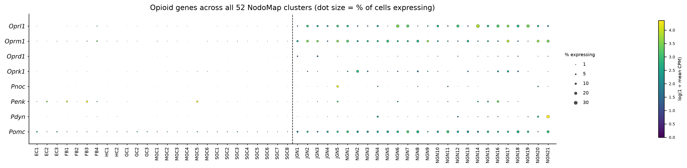
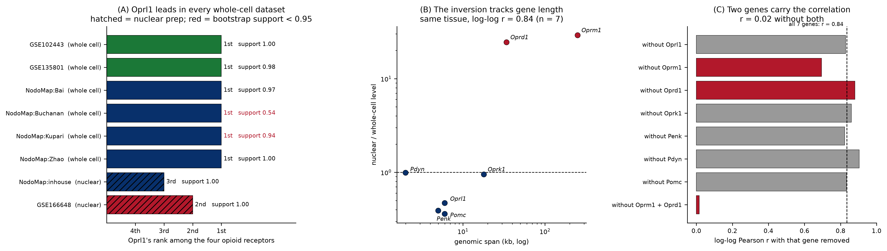

# The `Oprl1` (NOP receptor) atlas of peripheral sensory ganglia

Where the nociceptin/orphanin FQ receptor `Oprl1` is expressed across mouse peripheral
sensory neurons, recomputed from source across three tissues and eight datasets.

| input | tissue | source |
|---|---|---|
| [PNOC-Nodose](https://github.com/AlexanderJais/PNOC-Nodose) | nodose and jugular ganglia | NodoMap atlas, 106,436 cells in 52 clusters, 5 datasets |
| [Oprl1_Junhe](https://github.com/AlexanderJais/Oprl1_Junhe) | geniculate ganglion | GSE102443 (96 cells), GSE135801 (454 cells) |
| this repo | nucleus of the solitary tract | GSE166648, 49,392 neuronal nuclei in 25 subtypes |

Every number is recomputed from the GEO and CELLxGENE source matrices through one pipeline.
Nothing is carried over from the summary tables of the input projects.

---

## Results

### `Oprl1` is the highest-expressed opioid receptor of peripheral sensory neurons

Across two anatomically and functionally distinct ganglia, in six independently generated
whole-cell datasets, `Oprl1` ranks first among the four opioid receptors measured in the same
cells (`results/top_receptor_by_dataset.csv`).

`support` is the fraction of 2,000 cell bootstrap resamples in which the top receptor stays
top. It is reported because a 1.8 % lead and a 27 % lead are otherwise printed identically:

| dataset | tissue | preparation | top receptor | margin over runner-up | bootstrap support |
|---|---|---|---|---|---|
| GSE102443 | geniculate | whole cell | **`Oprl1`** | 6.92× | 1.00 |
| GSE135801 | geniculate | whole cell | **`Oprl1`** | 4.02× | 0.98 |
| NodoMap:Bai | nodose/jugular | whole cell | **`Oprl1`** | 1.27× | 0.97 |
| NodoMap:Buchanan | nodose/jugular | whole cell | **`Oprl1`** | 1.02× | **0.54** |
| NodoMap:Kupari | nodose/jugular | whole cell | **`Oprl1`** | 1.33× | 0.94 |
| NodoMap:Zhao | nodose/jugular | whole cell | **`Oprl1`** | 1.19× | 1.00 |
| NodoMap:inhouse | nodose/jugular | nuclear | `Oprm1` | 45.5× | 1.00 |
| GSE166648 | NTS (central) | nuclear | `Oprm1` | 7.48× | 1.00 |

Rank is the only receptor statistic compared across these datasets. The four receptors are
measured on the same cells with the same chemistry, so their ordering is informative even
where the absolute units (FPKM against CPM) are not.

**Five of the six whole-cell results are secure; Buchanan is not.** There `Oprl1` leads
`Oprm1` by 1.8 % and the ordering survives resampling only 54 % of the time — that dataset
should be read as "the two are level", not as a sixth independent win. The strongest results
are the two geniculate datasets, where `Oprl1` leads by 4–7×.

### Which neurons carry `Oprl1`

**Nodose and jugular** (`results/nodose_oprl1_by_cluster.csv`). `Oprl1` is broadly distributed
across the neuronal clusters rather than confined to one population, and is near-absent from
the non-neuronal compartment. Detection ranges from 27.7 % of cells in NGN14 down to 0.8 % in
NGN5; the top clusters are NGN14 (43.5 CPM), NGN6 (30.5), NGN19 (30.3), NGN17 (31.7) and NGN7
(25.0). Jugular clusters sit mid-range, JGN2 highest at 12.5 %.




**Geniculate** (`results/geniculate_per_cell_GSE102443.csv`). In the deep SMART-seq data
`Oprl1` is detected in 92 % of the 96 neurons, at 5.73 FPKM — the 63.8th percentile of
expressed genes in that sample. It is present in both divisions of the ganglion at
indistinguishable levels: gustatory (Phox2b+) neurons mean 6.29 FPKM (n = 61), somatosensory
(Phox2b−) 4.77 FPKM (n = 35). This is a general property of geniculate neurons, not a marker
of one division.


**NTS** (`results/nts_by_subtype.csv`). `Oprl1` is expressed across all 25 neuronal subtypes,
highest in the glutamatergic Glu9 (27.8 CPM, n = 1,155), Glu13 (22.6) and Glu7 (21.9), lowest
in GABA5 (7.7). Detection rates are low throughout (1–7 %) because this is a nuclear
preparation.


`Oprl1` is strongly neuron-enriched in the ganglia: log2 enrichment over non-neuronal cells is
**+3.53** in the whole-cell nodose datasets, comparable to `Oprk1` (+3.49) and `Oprm1` (+3.24)
and far above `Oprd1` (+1.62) (`results/nodose_neuron_enrichment.csv`).

### snRNA-seq inverts the receptor ordering, and the inversion tracks gene length

Both dissenting datasets are snRNA-seq, and both invert the ordering the same way. Within the
nodose ganglion, where whole-cell and nuclear data exist for the *same tissue*, the size of
the inversion tracks genomic span (`results/nuclear_bias_vs_gene_length.csv`):

| gene | genomic span | nuclear / whole-cell level |
|---|---|---|
| `Oprm1` | 250 kb | **29.0×** |
| `Oprd1` | 34 kb | **24.4×** |
| `Oprk1` | 18 kb | 0.95× |
| `Oprl1` | 6 kb | 0.47× |
| `Pomc` | 6 kb | 0.36× |
| `Penk` | 5 kb | 0.39× |
| `Pdyn` | 2 kb | 0.99× |

log-log Pearson *r* = 0.84 (n = 7 genes; Spearman rho = 0.58, *p* = 0.18). Nuclear
preparations retain unspliced pre-mRNA, so long-intron genes gain signal. `Oprm1` spans 250 kb
against `Oprl1`'s 6 kb, and gains 29-fold. Weighting the whole-cell baseline by cell count
rather than by dataset changes little (`Oprm1` 25.4×, `Oprl1` 0.45×).

**How much of that correlation is real.** It is carried by two of the seven genes. Dropping
`Oprm1` and `Oprd1` takes *r* from 0.84 to **0.02** — the remaining five genes span 2–18 kb
with ratios 0.36–0.99 and show no trend (`results/nuclear_bias_sensitivity.csv`, panel C
below). Two further caveats: `Oprd1`'s 24.4× is a ratio against a 0.22 CPM floor, and
preparation type is perfectly confounded with laboratory here — there is one nuclear nodose
dataset (765 neurons, in-house) and no in-house whole-cell dataset, so "nuclear" and
"in-house" cannot be separated. `Oprm1` detection also rises from 5–9 % to 71.9 % in that
dataset, which is as consistent with an intron-inclusive alignment as with pre-mRNA retention.

So: the direction of the effect is clear and reproducible, the mechanism is plausible and
consistent with the two largest points, and the quantitative gene-length relationship across
all seven genes is not established.

**The practical conclusion is unaffected: opioid receptor ranking should not be read off
snRNA-seq data.** This applies to the NTS dataset here as much as to the nodose one, so this
project makes no claim about a peripheral against central receptor switch.



### Other opioid genes

Reported for context, not analysed. The one clear tissue difference is `Penk`: in the
geniculate it is among the most abundant transcripts in the neurons themselves (166 FPKM,
97.6th percentile of expressed genes, GSE102443), while in the nodose and jugular ganglia it
is depleted in neurons relative to other cells (log2 enrichment −1.46), being largely a
fibroblast transcript there. `Pnoc` is low in every peripheral dataset (0.6–3.4 CPM) and is
not quantified at all in GSE102443. Per-gene levels and detection rates for all eight opioid
genes are in the `*_opioid_levels.csv` tables and the dot plots above.

---

## Corrections to the input projects

**`Pnoc` absence in the deep geniculate data is a reference gap, not a measured zero.**
GSE102443 quantifies 17,110 genes and `Pnoc` is not among them, so the gene was never measured
rather than measured at zero. Every table in this repo therefore carries an `in_matrix` column
taken from the matrix itself, and an unmeasured gene is recorded as null rather than 0.

**`Oprl1` dominance does hold in the nodose ganglion**, which a comparison of detection rates
obscures. On percent-of-cells-detected, `Oprl1` and `Oprm1` look comparable in the nodose
data. On expression level, `Oprl1` ranks first in all four whole-cell nodose datasets —
though in one of them (Buchanan) only nominally, as above. Detection rate saturates and is
depth-sensitive; level is the statistic that transfers.

**The pooled NodoMap atlas ranks `Oprm1` first** (15.36 against 11.41 CPM), because the pooled
mean mixes the nuclear in-house set into the whole-cell data. That is the artefact described
above, which is why every table here is reported per dataset as well as pooled.

## Methods

Levels are pseudobulk means computed per dataset: FPKM for GSE102443, mean per-cell CPM
elsewhere. Transcript rows are summed to gene level, and a gene symbol appearing on more than
one annotation row has its rows summed rather than truncated to the first. Detection
percentages are recorded in the per-tissue tables but are never compared across assays.

The statistics that carry the cross-tissue claims are in `src/atlas_common.py`:

- `receptor_rank()`, the ordering of the four receptors in one sample. It reports
  `determinate = False` when every level is zero or the top two are tied, so a `rank == 1` row
  is never read as a winner by accident.
- `bootstrap_receptor_support()`, the fraction of 2,000 cell resamples in which the observed
  top receptor stays top, plus a 95 % interval on the margin.
- `transcriptome_percentile()`, a gene's position in its own sample's expression distribution.
- `leave_one_out_pearson()`, the gene-length correlation recomputed with each gene dropped.

Each dataset passes `check_markers()` before any opioid number is read from it. `Snap25` and
`Actb` are enforced — absent or zero raises `SanityCheckError` — and `Phox2b`, `Slc17a6`,
`Tac1` and `Calca` are recorded without being enforced, since they are tissue-specific. The
results are written to `*_marker_checks.csv`.

Preparation type is read from the NodoMap atlas's own `suspension_type` field and checked
against the registry in `atlas_common.DATASETS`; a disagreement raises rather than being
silently overridden.

The GSE166648 matrix is a dense genes-by-cells CSV that expands beyond the session's disk
allowance, so it is streamed once, retaining target gene rows and accumulating a per-gene
total in the same pass, then cached to `data/gse166648_targets.npz`.

Figures follow the idiom of the sibling PNOC-Nodose project (`src/atlas_style.py`): FeaturePlot
overlays on the published UMAP, ranked bars of percent-expressing per cluster, and dot plots
sized by percent-expressing and coloured by mean expression.

## Reproducing

```bash
pip install -r requirements.txt
export NODOSE_ROOT=/path/to/PNOC-Nodose   # optional; defaults to /home/user/PNOC-Nodose
bash src/00_download_data.sh    # GEO matrices + the NodoMap atlas, checksummed
python3 src/01_geniculate.py    # GSE102443 + GSE135801
python3 src/02_nodose.py        # NodoMap atlas from CZ CELLxGENE
python3 src/03_nts.py           # GSE166648, streamed and cached
python3 src/04_synthesis.py     # cross-tissue tables and the synthesis figure
python3 -m pytest tests -q      # 28 unit tests over the shared statistics
```

`src/00_download_data.sh` fetches everything, including the 830 MB NodoMap atlas from CZ
CELLxGENE, and verifies SHA-256 checksums so a truncated download fails at the download step.

| file | contents |
|---|---|
| `oprl1_across_datasets.csv` | `Oprl1`'s rank among the four receptors, per dataset |
| `top_receptor_by_dataset.csv` | top receptor per dataset, with bootstrap support |
| `nodose_oprl1_by_cluster.csv` | `Oprl1` level and detection in each of the 52 clusters |
| `nts_by_subtype.csv` | `Oprl1` across the 25 NTS neuronal subtypes |
| `geniculate_per_cell_GSE102443.csv` | per-cell `Oprl1` FPKM, split gustatory/somatosensory |
| `geniculate_opioid_levels.csv` | 8 genes × 2 geniculate datasets, level, detection, percentile |
| `nodose_opioid_levels.csv` | 8 genes × nodose, jugular, and each of the 5 datasets |
| `nts_opioid_levels.csv` | 8 genes in NTS neurons and non-neurons |
| `*_receptor_rank.csv` | receptor ordering per dataset |
| `*_rank_support.csv` | bootstrap support and margin intervals |
| `*_marker_checks.csv` | marker-gene gate results per dataset |
| `nodose_neuron_enrichment.csv` | neuron against non-neuron levels, whole-cell datasets only |
| `nuclear_bias_vs_gene_length.csv` | the gene-length analysis |
| `nuclear_bias_sensitivity.csv` | that correlation with each gene dropped in turn |

## Provenance

- GSE102443 Dvoryanchikov et al. 2017, *Nat Commun*, 96 geniculate neurons, SMART-seq
- GSE135801 Zhang et al. 2019, *Cell* (Zuker lab), 454 Phox2b+ geniculate neurons
- GSE166648 Ludwig et al., dorsal vagal complex snRNA-seq, 72,128 nuclei
- NodoMap Cheng et al. 2026, *Cell Press Blue* 1:100072, doi:10.1016/j.cpblue.2026.100072,
  via CZ CELLxGENE collection `982f9f44-031c-4c8c-91ee-dcaa53b10151`

`AUDIT.md` records a full code audit of this repository and the state of each finding.
