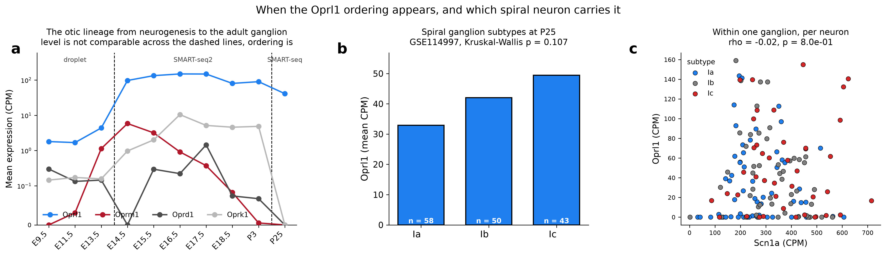
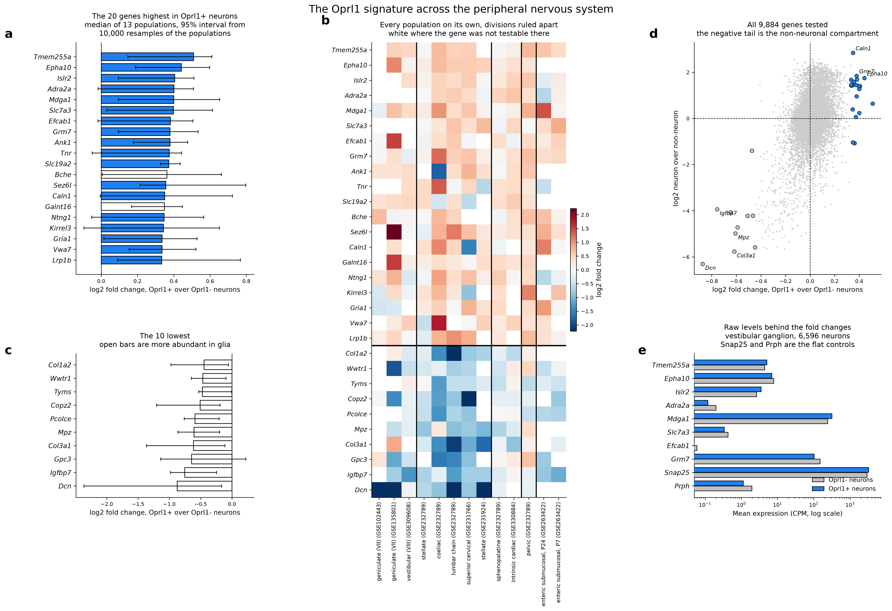
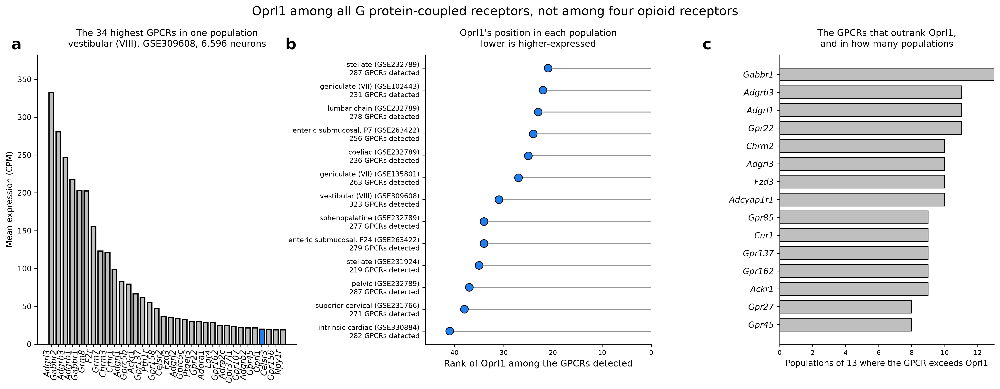
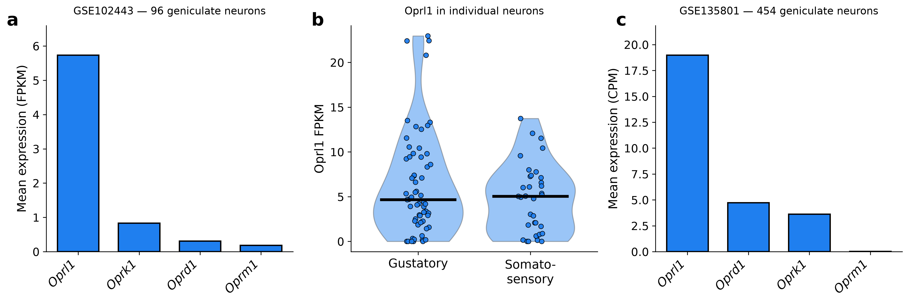
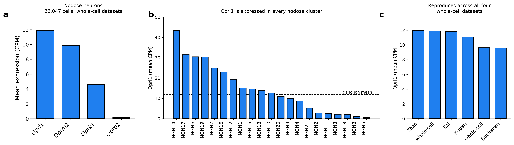
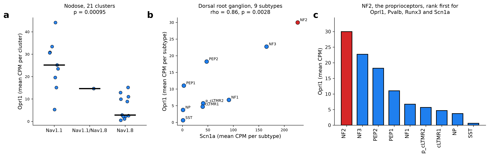
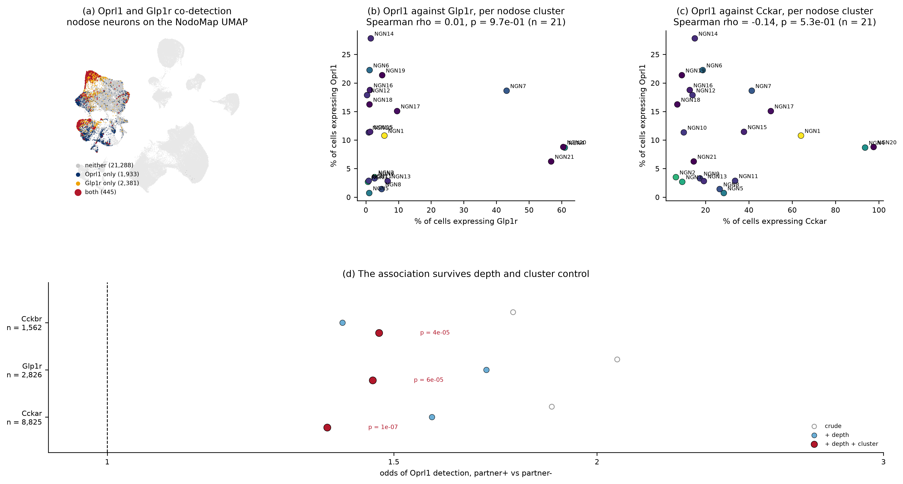
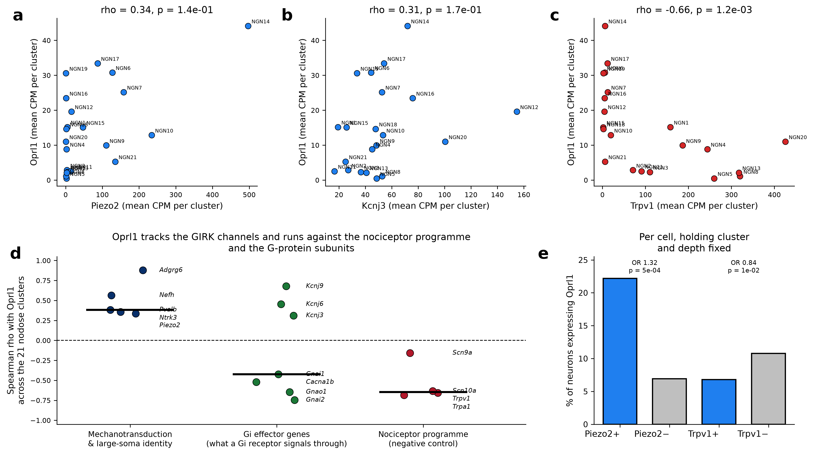
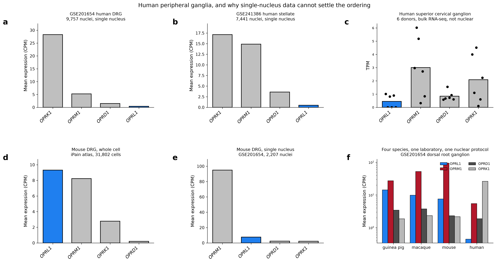

# *Oprl1* is the dominant opioid receptor of peripheral neurons

In mouse geniculate ganglion neurons *Oprl1* is expressed 31-fold above *Oprm1* and is detected in
92% of cells. The ordering reproduces on a second platform from a second laboratory. It holds in
eighteen of the nineteen peripheral populations measured here, covering every sensory ganglion
with public data across all three developmental origins, the sympathetic, parasympathetic and
enteric divisions of the autonomic nervous system, and the dorsal root ganglion, where most work
on opioid receptors in peripheral neurons has been done and where that work targets *Oprm1*. The
exception is enteric submucosal neurons at P7, where *Oprk1* is higher. This is a mouse result:
section 9 shows that the human data available cannot settle the same question, and that the one
unbiased human dataset argues against it. Against the wider
denominator of every G protein-coupled receptor measured in the same cells, *Oprl1* ranks 31st of
around 280 detected, the 90th percentile, while *Oprm1* and *Oprd1* sit at the middle of that
distribution.

| input | tissue | source |
|---|---|---|
| [Oprl1_Junhe](https://github.com/AlexanderJais/Oprl1_Junhe) | geniculate ganglion | GSE102443 (96 cells), GSE135801 (454 cells) |
| [PNOC-Nodose](https://github.com/AlexanderJais/PNOC-Nodose) | nodose and jugular ganglia | NodoMap atlas, 106,436 cells in 52 clusters, 5 datasets |
| [iPain Atlas](https://cellxgene.cziscience.com/collections/03608e22-227a-4492-910b-3cb3f16f952e) | trigeminal and dorsal root ganglia | 84,658 and 191,798 cells |
| this repo | nucleus of the solitary tract | GSE166648, 49,392 neuronal nuclei in 25 subtypes |

Every number is recomputed from the GEO and CELLxGENE source matrices through one pipeline.
Data-quality analyses are in [`SUPPLEMENT.md`](SUPPLEMENT.md); the code audit is in
[`AUDIT.md`](AUDIT.md).

Both headline claims rest on the geniculate SMART-seq data, GSE102443, n = 96 neurons.
Full-length library preparation is what makes a 92% detection rate interpretable; droplet data
reaches that figure for no gene. The nodose droplet datasets agree with both claims without
independently establishing either, since their highest per-cluster detection rate is 27.7% and
that value is a platform ceiling. A single 96-cell experiment carries a large share of the
evidence. The replication that matters is GSE135801: different platform, different laboratory,
same ordering.

---

## 1. *Oprl1* is the highest-expressed opioid receptor in every ganglion measured

Mean expression of the four opioid receptors, measured in the same cells, in each dataset's own
unit, grouped by division of the peripheral nervous system
(`results/receptor_levels_by_ganglion.csv`, `results/peripheral_receptor_levels.csv`):

**Sensory**

| dataset | tissue | *Oprl1* | *Oprm1* | *Oprd1* | *Oprk1* | *Oprl1*:*Oprm1* |
|---|---|---|---|---|---|---|
| GSE114997 (CPM) | spiral (VIII) | 41.94 | 0.00 | 0.00 | 0.00 | only one detected |
| GSE309608 (CPM) | vestibular (VIII) | 19.88 | 1.78 | 0.09 | 4.63 | 11.2× |
| GSE102443 (FPKM) | geniculate (VII) | 5.73 | 0.18 | 0.31 | 0.83 | 31× |
| GSE135801 (CPM) | geniculate (VII) | 18.98 | 0.01 | 4.72 | 3.61 | large |
| iPain, trigeminal neurons (CPM) | trigeminal (V) | 13.24 | 6.36 | 1.46 | 5.12 | 2.08× |
| NodoMap, nodose neurons (CPM) | nodose (X) | 11.90 | 9.86 | 0.13 | 4.63 | 1.21× |
| NodoMap, jugular neurons (CPM) | jugular (X) | 9.62 | 8.33 | 0.92 | 0.90 | 1.16× |
| iPain, DRG neurons (CPM) | dorsal root | 9.31 | 8.23 | 0.20 | 2.78 | 1.13× |

**Sympathetic**

| dataset | tissue | *Oprl1* | *Oprm1* | *Oprd1* | *Oprk1* | *Oprl1*:*Oprm1* |
|---|---|---|---|---|---|---|
| GSE78845 (CPM) | thoracic chain | 62.30 | 1.48 | 3.90 | 4.24 | 42× |
| GSE232789 (CPM) | stellate | 27.55 | 0.56 | 0.03 | 4.53 | 49× |
| GSE232789 (CPM) | coeliac | 25.03 | 0.42 | 0.03 | 0.56 | 59× |
| GSE232789 (CPM) | lumbar chain | 24.76 | 1.68 | 0.03 | 0.39 | 15× |
| GSE231924 (CPM) | stellate | 23.93 | 4.84 | 5.04 | 5.12 | 4.9× |
| GSE231766 (CPM) | superior cervical | 18.68 | 0.27 | 0.57 | 0.73 | 69× |
| GSE232789 (CPM) | pelvic (mixed) | 16.33 | 0.50 | 0.43 | 0.46 | 32× |

**Parasympathetic and enteric**

| dataset | tissue | *Oprl1* | *Oprm1* | *Oprd1* | *Oprk1* | *Oprl1*:*Oprm1* |
|---|---|---|---|---|---|---|
| GSE263422 (CPM) | enteric submucosal, P24 | 35.57 | 0.18 | 16.14 | 3.77 | 199× |
| GSE263422 (CPM) | enteric submucosal, P7 | 26.70 | 0.74 | 2.29 | 122.51 | 36× |
| GSE232789 (CPM) | sphenopalatine | 19.50 | 0.29 | 0.04 | 0.02 | 67× |
| GSE330884 (CPM) | intrinsic cardiac | 11.13 | 3.05 | 0.36 | 0.00 | 3.7× |

**Central, for reference**

| dataset | tissue | *Oprl1* | *Oprm1* | *Oprd1* | *Oprk1* | *Oprl1*:*Oprm1* |
|---|---|---|---|---|---|---|
| GSE166648, NTS neurons (CPM) | NTS | 15.79 | 118.04 | 9.62 | 11.75 | 0.13× |

*Oprl1* is highest in eighteen of the nineteen peripheral populations. The exception is the P7
enteric row, treated in "The enteric exception" below.

The geniculate result carries the claim. *Oprl1* at 5.73 FPKM against *Oprm1* at 0.18 is an
order-of-magnitude difference in transcript abundance rather than a difference in rank order, and
it reproduces in GSE135801 (*Oprl1* 18.98 CPM, *Oprm1* 0.01 CPM), where support is 0.974 and
the interval on the margin runs from 0.99 to 36.7, so that dataset establishes the ordering
without constraining its size. *Oprm1* is the least abundant of
the four receptors in geniculate neurons.

The nodose data agrees at a much smaller margin. *Oprl1* is highest there at 11.90 CPM against
*Oprm1* 9.86, and comes first in each of the four whole-cell datasets separately (11.98, 11.84,
11.09, 9.59 CPM). Resampling the cells 2,000 times, that ordering holds in 100%, 97% and 94% of
resamples for Zhao, Bai and Kupari, and in 56% for Buchanan
(`results/*_rank_support.csv`). Buchanan gives an ordering indistinguishable from a tie. The four
nodose datasets corroborate the geniculate result; they do not constitute four independent
demonstrations of it.

The jugular ganglion marks the edge of the claim. Geniculate and nodose are epibranchial
placode-derived; the jugular is neural-crest-derived and sits in the same tissue block as the
nodose, so it tests whether the ordering follows developmental origin. Restricted to whole-cell
data, *Oprl1* leads there at 9.62 CPM against *Oprm1* 8.33, a margin of 1.16× with bootstrap
support 0.898 and a 95% interval on the margin of 0.92 to 1.46, which includes 1. Across the three
jugular datasets with enough cells, Kupari and Zhao place *Oprl1* first (support 0.99 and 0.81)
and Buchanan places *Oprm1* first at support 0.51. The crest ganglion agrees in direction at the
weakest margin measured in any peripheral dataset here.

The ordering holds in the two somatic ganglia. In the trigeminal ganglion *Oprl1* reaches 13.24
CPM against *Oprm1* 6.36, a margin of 2.08× with support 1.000 and a 95% interval of 1.41 to 3.26
(n = 2,773 whole-cell neurons). In the dorsal root ganglion *Oprl1* reaches 9.31 CPM against
*Oprm1* 8.23, a margin of 1.13× with support 1.000 and an interval of 1.08 to 1.19 that excludes 1
(n = 31,802 whole-cell neurons). The DRG margin is the narrowest measured here and the DRG sample
is the second largest.

The spiral ganglion gives the clearest case. In 226 neurons sequenced to a median depth of 2.7
million reads, *Oprl1* is detected in 74.8% of cells at 41.94 CPM and *Oprm1*, *Oprd1* and
*Oprk1* are detected in none. All four are present in the annotation, so those are measured zeros.
Depth is 730-fold above the nodose droplet median, which is what makes a zero interpretable. The
same neurons carry *Scn1a* at 310.2 CPM, *Pvalb* at 882.6 and *Scn10a* at 0.00, the Nav1.1
profile that section 5 predicts should be *Oprl1*-high.

The vestibular ganglion replicates the spiral result in the same placode. Across 6,596 neurons
from four mice, *Oprl1* reaches 19.88 CPM in 57.6% of cells against *Oprk1* 4.63, *Oprm1* 1.78 and
*Oprd1* 0.09, a margin of 4.29× over the runner-up with support 1.000 and the same ordering in
each of the four samples separately. *Scn1a* reads 398.0 CPM and *Scn10a* 0.00, matching the
spiral profile.

### The sympathetic division

The title said sensory for six revisions without that being tested. Sympathetic neurons are the
control: peripheral, not sensory, neural-crest-derived, and available at the same full-length
depth as the strongest sensory datasets. In 298 mouse thoracic sympathetic neurons (Furlan et al.
2016, median library 33,099, identity confirmed by *Th* 2,316 CPM and *Dbh* 1,822), *Oprl1*
reaches 62.30 CPM in 82.2% of cells against *Oprk1* 4.24, *Oprd1* 3.90 and *Oprm1* 1.48. The
margin is 14.69× over the runner-up and 42× over *Oprm1*, with support 1.0000.

The control does not break the pattern. It shows the pattern at a larger margin than any sensory
ganglion except the geniculate and the spiral, and places *Oprl1* at the 81.2nd percentile of
expressed genes, above both the nodose (73.6) and the geniculate (63.8). The word "sensory" has
been removed from the title, since the restriction it asserted is not supported by the one
experiment that tested it.

That result rested on 298 cells in the platform class that produces the largest margins in this
project, so it was repeated in a second sympathetic dataset chosen to share nothing with the first
but the cell type. GSE231766 is 10x droplet data from the superior cervical ganglion, a cranial
rather than a thoracic ganglion, from a different laboratory. In the 1,382 neurons from its two
untreated animals, *Oprl1* reaches 18.68 CPM against *Oprk1* 0.73, *Oprd1* 0.57 and *Oprm1* 0.27,
a margin of 25.72× over the runner-up and 69× over *Oprm1*, with support 1.0000. Each of the four
samples in that dataset places *Oprl1* first on its own, including the two with experimental heart
disease, so the disease condition neither produces the result nor obscures it. *Scn1a* reads 16.12
CPM against *Scn10a* 0.09, the same sodium channel profile section 5 describes, in neurons that
are not sensory at all.

A third dataset settles the sympathetic case. GSE231924 profiles cardiac-projecting neurons of the
stellate ganglion, a third sympathetic ganglion from a third laboratory. *Oprl1* reaches 23.93 CPM
in 1,303 neurons against *Oprk1* 5.12, *Oprd1* 5.04 and *Oprm1* 4.84, a margin of 4.68× with
support 1.0000, and all eight mice place *Oprl1* first individually. Three sympathetic ganglia,
three laboratories, and library depths 20-fold apart agree on the direction and on the size of the
lead over *Oprm1*: 42×, 69× and 4.9×.

### The parasympathetic division

GSE232789 is the dataset that makes the comparison between divisions internal. One laboratory
dissected the stellate, coeliac and lumbar chain ganglia (sympathetic), the sphenopalatine
ganglion (cranial parasympathetic) and two pelvic ganglia, and sequenced them on one platform, so
laboratory and chemistry drop out of the comparison.

In 2,014 sphenopalatine neurons *Oprl1* reaches 19.50 CPM in 49.9% of cells against *Oprm1* 0.29,
*Oprd1* 0.04 and *Oprk1* 0.02, a margin of 66.86× and the largest lead over *Oprm1* of any
ganglion in this atlas. Identity is cholinergic and not noradrenergic (*Slc18a3* 252 CPM, *Chat*
26, *Th* 2, *Dbh* 42), which is what distinguishes it from the sympathetic ganglia in the same
dataset. The three sympathetic ganglia in that dataset give 27.55, 25.03 and 24.76 CPM and the two
pelvic ganglia 16.33. Every ganglion in the series places *Oprl1* first.

The intrinsic cardiac nervous system agrees at a smaller margin. In 4,513 neurons from three mice
(GSE330884, *Slc5a7* 937 CPM, *Slc18a3* 475, *Prph* 2,992), *Oprl1* reaches 11.13 CPM against
*Oprm1* 3.05, *Oprd1* 0.36 and *Oprk1* 0.00, a margin of 3.65× with support 1.0000 and the same
ordering in each of the three samples. That is the narrowest parasympathetic margin measured and
the only one where *Oprm1* is the runner-up rather than a trace transcript.

### The enteric exception

Enteric neurons are where the pattern breaks, and the break is developmental rather than regional.
GSE263422 profiles submucosal neurons of the mouse small intestine at two ages, in one laboratory
on one platform. At P24, *Oprl1* reaches 35.57 CPM against *Oprd1* 16.14, *Oprk1* 3.77 and *Oprm1*
0.18, a margin of 2.20× with support 1.0000 and the same ordering in all three samples. At P7,
*Oprk1* reaches 122.51 CPM against *Oprl1* 26.70, a margin of 4.59× the other way, with support
1.0000 and the same ordering in both samples. This is the only population in this atlas where
*Oprl1* is not the highest opioid receptor.

The P7 result is not a depth artefact. The two ages come from the same laboratory, the same
platform and the same tissue, and *Oprk1* falls from 122.51 CPM at 32.7% detection to 3.77 CPM at
1.1% while *Oprl1* stays between 26 and 36 CPM. The direction of the change is specific to
*Oprk1*. Whatever holds *Oprl1* at the top of the family elsewhere in the peripheral nervous
system, it does not hold at P7 in the gut, and no other age series in this atlas has been examined
for the same effect.

*Oprm1* runs the other way in the same cells. At 0.18 CPM and 0.2% detection at P24 it is
effectively absent, against a literature on opioid-induced constipation that is built on *Oprm1*
in the gut wall. GSE263422 is submucosal, and that literature concerns the myenteric plexus, so
this atlas does not contradict it; the two preparations do not sample the same neurons. No
myenteric dataset in this survey passed neuronal QC, and the myenteric comparison is open.

One qualification applies to every row above. *Oprl1* dominates its receptor family without being
an abundant transcript. It sits at the 73.6th percentile of the 32,565 genes expressed in nodose
neurons and the 63.8th percentile in GSE102443, against *Trpv1* at the 95.3rd and *Scn10a* at the
96.1st in the same nodose cells. The claim is about the opioid receptor family, not about
transcript abundance in general. Section 3 puts the same question to the receptor family it
belongs to and returns a median rank of 31st among the GPCRs detected in these neurons, which is
the 90th percentile and not the top 20.

*Oprm1* in the dorsal root ganglion is highest in the peptidergic nociceptor populations, PEP1 at
13.93 CPM and SST at 12.06, which is where the peripheral analgesia literature places it. The same
pipeline that reproduces that distribution places *Oprl1* above *Oprm1* across the ganglion as a
whole.

Both iPain atlases are majority single-nucleus (trigeminal 70,772 of 84,658, DRG 123,645 of
191,798), so every figure above is restricted to whole-cell cells. Pooling preparations compresses
the trigeminal margin from 2.08× to 1.18×.


Figure 1 shows sixteen of the nineteen populations, one panel per ganglion, blocked by division.
The three omitted panels are the GSE232789 lumbar chain, pelvic and stellate ganglia, whose
numbers are in the tables above and in `results/peripheral_receptor_levels.csv`; GSE232789 is
represented in the figure by the coeliac and sphenopalatine panels and the stellate panel comes
from GSE231924 instead, so that no two figure panels of the same division come from the same
deposit.

Margin size in figure 1 tracks sequencing depth more than tissue. The two largest sensory margins
come from full-length libraries: the spiral ganglion at a median of 2,678,701 reads per cell and
GSE102443 by SMART-seq. The three smallest come from 10x droplet data, where the NodoMap median is
1,570 UMI per cell, a factor of 1,700 below the spiral ganglion. Margin size across panels
therefore reports partly what each platform can resolve, and the ordering should not be read as a
biological gradient across ganglia. The consistent finding is the direction, which holds
regardless of depth; the size of the lead is only interpretable within a preparation.

Depth does not determine the margin on its own. The superior cervical ganglion sits at the same
droplet depth as the vestibular ganglion and gives a margin six times larger, 25.72× against
4.29×. Within GSE232789, where depth and chemistry are held constant across five ganglia, the
margin still runs from 6.08× in the stellate to 66.86× in the sphenopalatine. Depth sets a ceiling
on the margin a dataset can report, and it does not fix where a dataset lands under that ceiling.

The eight-dataset version of this comparison, including the two nuclear preparations, is figure S3
in [`SUPPLEMENT.md`](SUPPLEMENT.md).

The two single-nucleus datasets place *Oprm1* first. This is a preparation artefact: nuclear
preparations retain unspliced pre-mRNA and *Oprm1* spans 250 kb against *Oprl1*'s 6 kb. See
[`SUPPLEMENT.md`](SUPPLEMENT.md). Those datasets carry no claim here.

### When the ordering appears

The otic lineage is the one tissue in this atlas that can be followed from neurogenesis to the
adult, so it is where the ordering can be dated. Three deposits cover it: GSE178931 at E9.5, E11.5
and E13.5 on droplet, GSE165502 from E14.5 to P3 on SMART-seq2, and GSE114997 at P25 on SMART-seq
(`results/otic_lineage_by_age.csv`).

*Oprl1* is already the highest opioid receptor in the earliest otic neuroblasts. At E9.5, in 307
cells called on *Neurod1* and *Tubb3* raw counts, it reads 1.80 CPM against *Oprd1* 0.30, *Oprk1*
0.14 and *Oprm1* 0.00, a margin of 6.0× with support 0.994. It is first at every age after that,
with support 1.000 throughout: 9.8× at E11.5, 3.9× at E13.5, then 14× to 42× from E14.5 to P3, and
at P25 it is the only opioid receptor detected in the ganglion at all.



Absolute level is not comparable across the two dashed lines in figure 1b, since the deposit and
the platform change there. Within GSE165502, which holds both fixed across six ages, *Oprl1* runs
97, 134, 149, 148, 80 and 90 CPM from E14.5 to P3: a rise into late embryonic development and a
fall towards birth, without ever losing first place.

The other three receptors behave differently, and that is the substantive part. *Oprm1* rises to
5.84 CPM at E14.5, then falls to 0.005 by P3 and to zero at P25. *Oprk1* peaks at 10.47 CPM at
E16.5 and settles near 4.6. Both are transiently expressed in the developing ganglion and
extinguished in the adult, while *Oprl1* persists. The adult spiral result in which *Oprl1* is the
only receptor detected is the end of a process, not a property the tissue had throughout.

Dominance is therefore present from differentiation rather than acquired. This is the answer for
one lineage. The enteric result above shows that the answer is not the same everywhere: *Oprk1*
leads at P7 in the gut and *Oprl1* leads by P24, so in that tissue the ordering is acquired.

### Coverage of the peripheral nervous system

| division | ganglion | origin | status |
|---|---|---|---|
| sensory | geniculate (VII) | epibranchial placode | measured |
| sensory | nodose (X) | epibranchial placode | measured |
| sensory | jugular (X superior) | neural crest | measured |
| sensory | trigeminal (V) | crest and placode | measured |
| sensory | dorsal root ganglion | neural crest | measured |
| sensory | spiral (VIII) | otic placode | measured |
| sensory | vestibular (VIII) | otic placode | measured |
| sensory | petrosal (IX) | epibranchial placode | not separable from pooled tissue |
| sympathetic | thoracic chain | neural crest | measured |
| sympathetic | stellate | neural crest | measured, two datasets |
| sympathetic | superior cervical | neural crest | measured |
| sympathetic | coeliac | neural crest | measured |
| sympathetic | lumbar chain | neural crest | measured |
| mixed autonomic | pelvic | neural crest | measured |
| parasympathetic | sphenopalatine | neural crest | measured |
| parasympathetic | intrinsic cardiac | neural crest | measured |
| enteric | submucosal, small intestine | neural crest | measured, P7 and P24 |
| enteric | myenteric | neural crest | no dataset passed neuronal QC |

The survey covers cranial visceral, gustatory, auditory and somatic afferents, all three
developmental origins of the peripheral sensory system, and the sympathetic, parasympathetic and
enteric divisions of the autonomic nervous system.

Two gaps remain. The myenteric plexus is the one where the *Oprm1* literature would predict a
different answer, and the datasets found for it (GSE292613 is the closest) contain glia and immune
cells rather than neurons: *Snap25* is detected in 0.4% of its plexus barcodes. The other is
developmental. The P7 enteric result shows that age can reverse the ordering, and no other
ganglion in this atlas has been measured at more than one age.

The petrosal is the one ganglion this survey cannot reach. Searching GEO across all assay types
and organisms returns a single mouse record containing petrosal tissue, GSE145216, whose samples
are titled "NJP ganglia": nodose, jugular and petrosal dissected and sequenced together. Petrosal
neurons cannot be separated from that pool without an established distinguishing marker. The
superior cervical ganglion returns nothing in CELLxGENE and is reached through GEO instead
(GSE231766).

Human data is unavailable for a different reason. The CELLxGENE human DRG atlas (Nguyen et al.,
eLife 2021, 1,837 nuclei) quantifies 31,654 genes including *OPRM1*, *OPRD1* and *OPRK1*, and
*OPRL1* appears under neither symbol nor Ensembl identifier ENSG00000125510. That is a reference
gap rather than a measured zero, the same situation as *Pnoc* in GSE102443. The dataset is also
single-nucleus, which biases toward *OPRM1* for the reason in figure S1.

The trigeminal and DRG analyses are recorded in `results/EXTERNAL_GANGLIA_NOTES.md` and
`results/drg_oprl1_by_subtype.csv`. Which checks ran on which population, and why any did not, is
in `results/dataset_quality_panel.csv`.

## 2. The *Oprl1* signature: a synaptic adhesion programme, in every division

Section 1 asks where *Oprl1* is expressed. This section asks what it is expressed with. The
question is answered without a candidate gene: in each of thirteen populations carrying a full
transcriptome, every gene is compared between *Oprl1*-positive and *Oprl1*-negative neurons, and
only what reproduces across the populations is kept.

Two design choices decide whether the answer means anything.

The statistic is a log2 fold change computed **within depth strata**, not a correlation across
cells. Per-cell Spearman between two sparsely detected transcripts measures capture depth: a cell
with more UMI detects more of everything, so nearly every gene correlates positively with nearly
every other. Section 5 records what that produced the first time this was attempted, a correlate
list topped by a Schwann-cell transcript arriving as ambient RNA. Here every comparison is made
between cells of the same dataset that detected a similar number of genes.

The resampling unit is the **dataset, not the cell**. The question is whether a partner reproduces
across the peripheral nervous system, so the thirteen populations are drawn with replacement
10,000 times and each draw yields a new median fold change per gene. A gene carried by one deep
dataset loses its median as soon as that dataset is missed. Genes testable in fewer than ten of
the thirteen are excluded before ranking, because a median over few values is unstable and ranking
on it puts the least-observed genes on top. That leaves 9,884 genes.

| gene | median log2 fold change | 95% interval | datasets | positive in | top-30 support |
|---|---|---|---|---|---|
| *Tmem255a* | 0.51 | 0.15 to 0.61 | 11 | 10 | 0.83 |
| *Epha10* | 0.44 | 0.19 to 0.60 | 10 | 10 | 0.60 |
| *Islr2* | 0.41 | 0.10 to 0.51 | 11 | 10 | 0.37 |
| *Adra2a* | 0.40 | −0.02 to 0.51 | 10 | 7 | 0.45 |
| *Mdga1* | 0.40 | 0.10 to 0.65 | 13 | 12 | 0.45 |
| *Slc7a3* | 0.40 | 0.03 to 0.61 | 10 | 9 | 0.48 |
| *Grm7* | 0.38 | 0.10 to 0.53 | 13 | 12 | 0.42 |
| *Ank1* | 0.38 | 0.18 to 0.48 | 10 | 9 | 0.43 |
| *Sez6l* | 0.36 | 0.22 to 0.80 | 12 | 10 | 0.47 |
| *Ntng1* | 0.35 | −0.05 to 0.57 | 13 | 9 | 0.24 |

The signature is a synaptic and axonal adhesion programme. Of the top 30, the majority are
cell-surface recognition molecules: *Epha10*, *Islr2*, *Mdga1*, *Sez6l*, *Kirrel3*, *Ntng1*,
*Lrp1b*, *Tenm1*, *Tnr*, *Brinp2* and *Tmem132e*. The rest are ion-handling and signalling genes
of the same compartment, *Grm7*, *Gria1*, *Caln1* and *Ank1*, together with one G protein-coupled
receptor that shares *Oprl1*'s coupling, the Gi-linked adrenoceptor *Adra2a*. Effect sizes are
modest, 1.2 to 1.4 fold across the top 30, which is what a partner shared across five divisions of
the nervous system looks like.



Three controls decide whether to read it as biology.

*Oprl1*-positive neurons are not simply better-captured neurons. *Snap25* ranks 4,473rd of 9,884
at +0.03 and *Prph* 6,012th at −0.01, so pan-neuronal content is flat between the two groups while
the adhesion genes move. Depth stratification already holds total counts fixed; these two show
that the neuronal fraction of those counts is fixed as well.

The negative tail is the non-neuronal compartment, and it recovers itself. The ten genes lowest in
*Oprl1*-positive neurons are *Dcn*, *Igfbp7*, *Gpc3*, *Col3a1*, *Mpz*, *Pcolce*, *Copz2*, *Tyms*,
*Wwtr1* and *Col1a2*: fibroblast collagen and matrix transcripts plus the Schwann-cell marker
*Mpz*. Every one of them scores between −1.4 and −6.3 log2 neuron over non-neuron. The statistic
was not told what glia are, and it placed them at one end.

Contamination does not carry the positive end. Twenty-five of the top 30 are more abundant in
neurons than in the non-neuronal cells of the same ganglion. The five that are not, *Bche*,
*Galnt16*, *Nfatc2*, *Slc12a7* and *Asah2*, are drawn as open bars in figure 2 and should be
treated as contamination candidates rather than partners.

*Scn1a*, the sodium channel that section 5 places on *Oprl1* neurons in the vagus and the dorsal
root ganglion, ranks 144th of 9,884 at +0.22, positive in 8 of the 11 populations where it was
testable. The candidate-gene result from one atlas survives an unbiased scan of thirteen, in the
top 1.5% of the transcriptome, without reaching the top 30.

Two limits apply. Which cells count as *Oprl1*-positive depends on what the platform resolves:
where *Oprl1* is detected in 10 to 90% of neurons the split is detection, and in the full-length
geniculate data, where it reaches 92%, the split is high against low level within the same depth
stratum. GSE102443 could not be split either way, with 88 of 96 neurons positive, and is absent
from this analysis. Five of the thirteen populations come from GSE232789, so the deposit count is
reported beside the dataset count in `results/oprl1_signature.csv`.

## 3. Among all GPCRs, *Oprl1* sits at the 90th percentile and not in the top 20

"Highest of the four opioid receptors" is a claim about a family of four, and it invites the reply
that the family is uniformly low. Section 1 does not answer that reply. This section changes the
denominator: *Oprl1* is ranked against every G protein-coupled receptor measured in the same
cells, in the same thirteen populations.

The receptor list is the curated non-sensory set from the IUPHAR/BPS Guide to Pharmacology, 356
mouse symbols. Olfactory, vomeronasal and taste receptors are left out deliberately. The mouse
genome carries over a thousand olfactory receptors that are silent outside the olfactory
epithelium, and counting them would raise any rank in any tissue without meaning anything. Between
219 and 323 of the 356 are detected in a given population, and that detected count is the
denominator used below.

The answer is mid-table and not top of the table. Across thirteen populations *Oprl1*'s median
rank is **31st of the GPCRs detected**, a 95% interval of 24 to 35 over 10,000 resamples of the
populations, and the 89.8th percentile. It reaches the top 20 in none of the thirteen and the top
10 in none. The range is narrow: 21st in the GSE232789 stellate ganglion, 41st in the intrinsic
cardiac ganglion, and between those two everywhere else.



The reply this section was written to answer does not survive, because the family is not uniformly
anything (`results/gpcr_rank_by_population.csv`):

| receptor | median rank | median percentile of GPCRs detected |
|---|---|---|
| *Oprl1* | 31 | 89.8 |
| *Oprk1* | 82 | 66.8 |
| *Oprm1* | 138 | 48.1 |
| *Oprd1* | 153 | 47.0 |

*Oprm1* and *Oprd1* sit at the middle of the GPCR distribution in peripheral neurons. *Oprl1* sits
four to five times higher in rank and a whole quartile higher in percentile. The separation
between *Oprl1* and the rest of the opioid family is not an artefact of comparing four genes to
each other.

What outranks it is mostly not neuromodulation. One GPCR exceeds *Oprl1* in all thirteen
populations, *Gabbr1*, the GABA-B receptor. Twenty-three exceed it in seven or more. Of the sixteen
most frequent, five are adhesion GPCRs (*Adgrb3*, *Adgrl1*, *Adgrl3*, *Adgre1*) and five are Class
A orphans or non-GPCR 7TM proteins (*Gpr22*, *Gpr85*, *Gpr137*, *Gpr162*, *Gpr27*, *Gpr45*).
Setting those aside leaves four receptors with a known endogenous neurotransmitter or neuropeptide
ligand that beat *Oprl1* in a majority of populations: *Gabbr1*, *Chrm2*, *Adcyap1r1* and *Cnr1*.
*Ackr1* also appears in nine and is an atypical chemokine receptor of erythrocytes and
endothelium, so its position is a contamination candidate rather than a neuronal result.

The claim that this supports is narrower than the one it replaces, and it is the one to make:
among peripheral neurons, *Oprl1* is a top-decile GPCR and the only opioid receptor that is. It is
not among the ten or twenty most abundant receptors on these cells, and section 1's margins should
not be read as implying that.

## 4. *Oprl1* is expressed in most neurons of the ganglion

In the geniculate, *Oprl1* is detected in 92% of the 96 neurons, at indistinguishable levels in
both divisions: gustatory (Phox2b+) 6.29 FPKM, n = 61; somatosensory (Phox2b-) 4.77 FPKM, n = 35
Expression is pan-geniculate.



This claim also rests on full-length data. A 92% detection rate is interpretable only on a
platform that can reach it. The droplet datasets reach 27.7% of cells in their highest cluster, so
they establish that *Oprl1* is present throughout the ganglion while leaving the per-neuron
fraction unresolved.

In the nodose and jugular ganglia, *Oprl1* appears in every one of the 26 neuronal clusters, from
27.7% of cells in NGN14 to 0.8% in NGN5, and is nearly absent from non-neuronal cells (log2
neuronal enrichment +3.53, against *Oprk1* +3.49, *Oprm1* +3.24 and *Oprd1* +1.62). The highest
clusters are NGN14 at 43.5 CPM, NGN17 at 31.7, NGN6 at 30.5 and NGN19 at 30.3.



## 5. Expression is graded by sodium channel class, in the vagus and the DRG

This gradient sits inside a gene expressed throughout the ganglion, and the effect is small
relative to sections 1 and 2. It was established in the vagus and then tested in the dorsal root
ganglion as a prediction.

Each NodoMap annotation is a property of the cluster, so the unit of analysis is the 21 nodose
clusters. Effect sizes below are cluster means, computed on the same basis as the test. An earlier
draft quoted cell-weighted ratios beside cluster-mean *p* values, which raised the fibre-type
effect from 2.7× to 5.1×.

| annotation | cluster-mean, high vs low | groups | *p* | Bonferroni (×4) |
|---|---|---|---|---|
| sodium channel | Nav1.1 / Nav1.8 = 4.02× | 9 / 11 | 0.00095 | 0.0038 |
| fibre type | myelinated / unmyelinated = 2.68× | 4 / 8 / 9 | 0.021 | 0.082 |
| sensor type | mechanosensor / nocisensor | 9 / 8 / 4 | 0.109 | 0.44 |
| organ projection | gut 17.56 vs broad 11.76 | 8 / 9 | 0.336 | 1.0 |

The sodium channel split is the only one that survives. Fibre type fails Bonferroni correction
across the four annotations tested, and its effect halves when computed on the same basis as its
own *p* value.

Fibre type is a proxy for sodium channel class. Cross-stratifying the two separates them
(`results/nodose_nav_fibre_crosstab.csv`):

| | myelinated | lightly myelinated | unmyelinated |
|---|---|---|---|
| Nav1.1 | 23.01 (n=3) | 25.60 (n=5) | 30.60 (n=1) |
| Nav1.8 | 12.88 (n=1) | 9.01 (n=2) | 4.78 (n=8) |

Sodium channel class holds inside every fibre stratum, at 1.8×, 2.8× and 6.4×. Fibre type inside
Nav1.1 is flat to reversed, with the single unmyelinated Nav1.1 cluster the highest of the nine.
The one fibre ordering sits in the Nav1.8 row and rests on n = 1 and n = 2. Myelination is
therefore dropped from every claim in this document.

The result is robust to the one ambiguous cluster. NGN18 is annotated Nav1.1/Nav1.8; *p* = 0.00095
with it excluded, 0.00072 assigned to Nav1.1, 0.00084 assigned to Nav1.8.

Four clusters show this more directly than the statistics do:

| cluster | n | CPM | Nav | fibre | sensor |
|---|---|---|---|---|---|
| NGN14 | 730 | 44.15 | Nav1.1 | myelinated | mechanosensor |
| NGN19 | 220 | 30.60 | Nav1.1 | unmyelinated | nocisensor |
| NGN1 | 4,370 | 15.17 | Nav1.8 | lightly myelinated | nocisensor |
| NGN21 | 192 | 5.28 | Nav1.1 | myelinated | mechanosensor |

NGN19 is an unmyelinated nociceptor and ranks 4th of 21. NGN21 is a myelinated Nav1.1
mechanosensor and ranks 17th. NGN1 is Nav1.8 and exceeds five of the nine Nav1.1 clusters. Sodium
channel class separates these four; myelination and sensor type do not.

The split also holds per cell against a matched null. Holding cluster and capture depth fixed, a
neuron expressing *Scn1a* is 1.72× more likely to express *Oprl1*, against a null of
expression-matched genes with median 1.36 (empirical *p* = 0.0099). *Scn10a* is 1.06 against a
null of 1.27, below chance.

The gradient is specific to *Oprl1* rather than a consequence of soma size. *Oprl1* CPM and
detection rate correlate at rho = 0.95 across clusters, so a cluster gradient could reflect total
RNA content. Testing 550 expression-matched genes for the same Nav1.1/Nav1.8 cluster ratio
(`results/nav_gradient_matched_null.csv`) gives a matched median of 1.11 against *Oprl1*'s 4.02,
with *Oprl1* exceeding 95.8% of them. The effect is solid at the 96th percentile.

The association replicates in the dorsal root ganglion, against a prediction made before that
data was obtained. Proprioceptors are the most Nav1.1-dependent sensory population known, so if
*Oprl1* tracks Nav1.1 generally they should rank near the top of *Oprl1* expression. The
proprioceptor population in the iPain atlas is NF2, which ranks first of nine whole-cell subtypes
for *Pvalb* (1,576 CPM), *Runx3* (86.9) and *Scn1a* (226.4). It ranks first for *Oprl1* as well, at
29.97 CPM. *Oprm1* ranks seventh of nine in the same population. Across the nine subtypes
(`results/drg_oprl1_by_subtype.csv`):

| partner | Spearman rho with *Oprl1* | *p* |
|---|---|---|
| *Scn1a* | +0.862 | 0.0028 |
| *Runx3* | +0.837 | 0.0049 |
| *Pvalb* | +0.817 | 0.0072 |
| *Ntrk3* | +0.550 | 0.125 |
| *Scn10a* | -0.700 | 0.036 |
| *Oprm1* | -0.183 | 0.637 |

Both directions of the nodose result appear again: positive with *Scn1a*, negative with *Scn10a*,
in a ganglion of different developmental origin and different modality.

The prediction fails inside the spiral ganglion, and the reason is instructive. GSE114997 has 186
wild-type P25 neurons at a median 2.7 million reads, enough to assign the type Ia, Ib and Ic
subtypes and test the association within one ganglion rather than between ganglia. Subtypes were
assigned twice, once by the published markers and once by unsupervised clustering with no
knowledge of them; 151 of 186 neurons agree and only those are used
(`results/spiral_subtype_per_cell.csv`). The assignment is what it should be: *Calb2* 10,577 CPM
in Ia, *Calb1* 288 in Ib, *Lypd1* 3,848 and *Pou4f1* 957 in Ic.

| subtype | n | *Oprl1* | *Scn1a* |
|---|---|---|---|
| Ia | 58 | 32.93 | 268.89 |
| Ib | 50 | 42.02 | 324.12 |
| Ic | 43 | 49.46 | 365.33 |

*Oprl1* and *Scn1a* rise together across the three subtypes, which is the predicted direction, but
neither the subtype difference nor the per-neuron correlation reaches significance:
Kruskal-Wallis *p* = 0.107 over the three subtypes, and Spearman rho = -0.020, *p* = 0.80 between
*Oprl1* and *Scn1a* across the 151 neurons individually.

The test had little to work with. Every spiral subtype is Nav1.1-positive and Nav1.8-negative, and
*Scn1a* varies only 1.36-fold across them against the 4.02-fold difference between the Nav1.1 and
Nav1.8 clusters of the nodose. The association in sections above is between populations that
differ in sodium channel class. Within a population that does not differ in sodium channel class,
it is absent. That bounds the claim rather than contradicting it, and the bound should be stated:
this is a between-population property, and no per-neuron association has been demonstrated
anywhere in this atlas.




The four nodose clusters that separate sodium channel class from fibre type, and the annotation
and transcriptome-wide panels behind this section, are figures S5 and S6 in
[`SUPPLEMENT.md`](SUPPLEMENT.md).

Nav1.1 supports high-frequency firing. *Oprl1* couples to Gi. Their co-occurrence identifies
neurons in which a Gi-coupled receptor is positioned to reduce firing in cells equipped to fire
rapidly. This description requires no projection target and no fibre class, and it applies to the
geniculate as readily as to the vagus.

Organ projection is descriptive. The *p* = 0.336 above compares the only two levels with more than
one cluster, gut (n = 8) against broad projection (n = 9), over 17 clusters. Duodenum, heart,
jejunum/ileum and pancreas contain one cluster each and were excluded from the test. An earlier
draft printed "pancreas 25.2 vs jejunum/ileum 5.3" beside that *p* value; those are NGN7 and
NGN21, one cluster against one cluster, from levels the test excluded. The pancreas figure is one
cluster's annotation in another laboratory's atlas and supports a retrograde-tracing experiment
and nothing further.

The transcriptome-wide correlate list carries a contamination component. All 54,640 genes were
correlated with *Oprl1* across the 21 clusters, and 2,149 of 16,380 expressed genes reach FDR
below 5%. NodoMap contains roughly 50,000 satellite and myelinating glia, and this pipeline
applies no ambient-RNA correction. Scoring the top 50 correlates against the glial compartment of
the same ganglion places 20 of 50 at higher abundance in glia than in nodose neurons.

*Adgrg6*/*Gpr126* is the clearest case and was previously cited here as supporting evidence. It is
8-fold more abundant in glia (log2 = -2.98). It is the Schwann-cell myelination receptor, and its
position at the top of the list reflects ambient RNA rather than neuronal identity. That citation
is withdrawn, along with *Col1a2* (-4.46), *Hmgcs2* (-3.58) and *Ptn* (-2.66). The neuronally
enriched correlates are *Cacng5* (+3.38), *Brinp1* (+2.79), *Atp1b1* (+2.78), *Eya4* (+2.29),
*Chgb* (+1.98) and *Rph3a* (+1.36). *Oprl1* itself is +3.48, so the gene of interest is unaffected.

Section 2 is the replacement for that list. It replaces a cluster-level correlation in one atlas
with a depth-stratified comparison in thirteen populations, and it recovers the contamination axis
as its own negative tail rather than as a caveat.

## 6. *Oprl1* shows no association with *Glp1r* or *Cckar*

This project began by testing whether *Oprl1* occupies the *Glp1r* and *Cckar* afferents, which
would place a Gi-coupled receptor on the first synapse of the gut-brain axis. The data rejects
that arrangement at both levels of analysis.

Across the 21 nodose clusters, *Glp1r* ranks 8,461 of 16,380 genes by correlation with *Oprl1*
(rho = +0.13, *q* = 0.74), *Cckbr* ranks 8,828 (+0.11) and *Cckar* ranks 11,270 (-0.06). All three
sit near the middle of the distribution.

At the cell level the apparent association is at chance. An earlier draft reported a surviving
1.46× odds ratio for *Glp1r* after stratifying on cluster and capture depth, without a benchmark.
Number of detected features is not cell size, and *Oprl1* is a comparatively high expresser in
large, transcriptionally active neurons, so within a cluster it yields a positive odds ratio
against most moderately expressed genes. Running the identical statistic against 100 control genes
matched on detection rate and mean expression:

| partner | observed OR | matched-null median | null 95% | empirical *p* | position |
|---|---|---|---|---|---|
| *Scn1a* (Nav1.1) | 1.72 | 1.36 | 1.02-1.58 | 0.0099 | above null |
| *Cckbr* | 1.47 | 1.36 | 0.98-1.73 | 0.29 | at chance |
| *Glp1r* | 1.46 | 1.26 | 0.95-1.64 | 0.20 | at chance |
| *Cckar* | 1.37 | 1.13 | 0.87-1.90 | 0.42 | at chance |
| *Piezo2* | 1.32 | 1.19 | 0.73-1.71 | 0.35 | at chance |
| *Scn10a* (Nav1.8) | 1.06 | 1.27 | 1.00-1.56 | 0.90 | below null |
| *Trpv1* | 0.84 | 1.27 | 1.04-1.52 | - | below null |

The null median falls between 1.13 and 1.36. Values in the 1.3 to 1.5 band match what an
expression-matched random gene produces. *Glp1r*, *Cckar* and *Cckbr* are at chance, and the
data provides no support for *Oprl1* occupying the satiation-receptor populations.



The co-expression table contains an internal comparator. After full adjustment *Cckbr* scores
highest of the three testable partners at 1.47, against *Glp1r* 1.46 and *Cckar* 1.37, a spread of
0.10. *Cckbr* is the gastrin/CCK-B receptor and has no role in vagal satiation signalling
comparable to the other two. Its position at the top of the three indicates that the residual
value near 1.4 is a floor set by abundance.

Two results survive the control: *Scn1a* above its null, and *Trpv1* and *Scn10a* below theirs.
*Oprl1* is depleted from the nociceptor population.

## 7. Mechanotransduction and Gi effector genes

Section 5 predicts that N/OFQ acting on the vagus would reduce firing in Nav1.1 neurons. Three
conditions would have to hold on the same cells: the mechanotransducer *Piezo2*, the Gi effector
genes a NOP receptor signals through (*Kcnj3/6/9*, *Gnai*, *Gnao*, *Cacna1b*), and the absence of
the nociceptor programme as an internal negative control.



The negative control behaves as required. The nociceptor programme runs against *Oprl1* across
clusters, with *Trpa1* rho = -0.68, *Trpv1* -0.66 and *Scn10a* -0.63, all *q* below 0.03, and
*Trpv1* falls below the matched null per cell. Two independent routes place *Oprl1* on Nav1.1
neurons and away from the nociceptor population.

*Piezo2* does not meet the condition. Cluster-level rho = 0.34 (*q* = 0.31), and per cell the odds
ratio is 1.32 against a matched null of 1.19. An earlier draft reported 2.00; that figure came
from depth deciles computed over the whole atlas rather than within the nodose neurons under
analysis, and it is retracted. The stratum-granularity table
(`results/vagal_or_stratum_stability.csv`) accounts for the difference: every odds ratio here
rises as the stratification coarsens, and *Piezo2* reads 1.32 at cluster by depth-tercile, 1.53 at
cluster by depth-median and 2.40 at cluster only. The 2.00 was an under-adjusted estimate of the
same quantity.

The Gi effector genes divide. *Kcnj9* tracks *Oprl1* (rho = 0.68, *q* = 0.015) while the G-protein
subunits run against it, with *Gnai2* at -0.75, *Gnao1* at -0.65 and *Cacna1b* at -0.52. The data
does not establish co-expression of *Oprl1* with the effector genes.

The experiment that would settle this applies N/OFQ to vagal afferents and measures the
mechanically evoked response: gastric or intestinal distension with nodose recording, wild-type
against NOP knockout, or *ex vivo* with SB-612111.

A convergent version of the clinical hypothesis remains open and requires no co-expression.
GLP-1 receptor agonists act substantially by slowing gastric emptying, which raises distension and
mechanoreceptor firing. N/OFQ that reduces mechanoreceptor firing would lower GLP-1RA efficacy by
acting on a separate population whose output converges on the same afferent volley. This
arrangement is consistent with everything measured here and is testable in the same *ex vivo*
preparation.

## 8. The geniculate result concerns taste, and conflicts with existing behaviour data

The strongest finding in this document, 5.73 against 0.18 FPKM in 92% of neurons across both
divisions, is in the gustatory ganglion. NOP-knockout mice show unchanged taste reactivity to
sucrose, and the reported diet-preference effects were argued to be independent of orosensory
properties. A receptor at this abundance with no reported gustatory phenotype requires an
explanation. Either the behavioural assays lack the resolution for what *Oprl1* does in these
neurons, or *Oprl1* serves a function other than modulating taste transmission: trophic support,
axonal excitability, or action on the somatosensory rather than the gustatory division. This
repository cannot distinguish these possibilities.

## 9. Human tissue: the question is open, and the preparation is why

Every claim above is a mouse claim. Human peripheral ganglia come from
post-mortem or surgical tissue that is snap-frozen, so essentially all human
single-cell data from them is single-nucleus. Figure S1 established what that
does to this comparison in mouse nodose tissue. GSE201654 lets it be checked in
a second tissue and a second laboratory, because it is a cross-species atlas of
dorsal root ganglion nuclei covering human, macaque, mouse and guinea pig on one
protocol.

The mouse arm is the control, and it fails in the informative direction. Mouse
dorsal root ganglion in whole-cell data places *Oprl1* first at 9.31 CPM against
*Oprm1* 8.23. The same tissue in nuclei places *Oprm1* first at 94.92 against
*Oprl1* 7.60, a 12.5-fold reversal. The nuclear artefact of figure S1 is
reproduced in a second ganglion and a second laboratory.



That is the standard against which the human rows have to be read, and it means
no human single-nucleus dataset in existence can establish a species difference,
because the mouse behaves the same way under the same preparation
(`results/human_xspecies_drg.csv`):

| species | *OPRL1* | *OPRM1* | *OPRD1* | *OPRK1* | first in |
|---|---|---|---|---|---|
| guinea pig | 14.37 | 27.39 | 3.45 | 1.88 | *OPRM1* in 3 of 4 |
| macaque | 9.89 | 52.43 | 3.77 | 2.34 | *OPRM1* in 6 of 6 |
| mouse | 7.60 | 94.92 | 2.33 | 2.17 | *OPRM1* in 6 of 6 |
| human | 0.45 | 5.48 | 1.89 | 26.21 | *OPRK1* in 6 of 6 |

A second problem sits on top of the first. The human population called by the
same rule does not look like neurons. *SNAP25* reads 29.6 CPM in it against
469.9 in macaque, 512.9 in mouse and 781.2 in guinea pig under the identical
protocol, and *OPRL1* comes out lower inside the called population than outside
it, at log2 -1.63, where every other species gives a positive enrichment. The
script prints a warning and reports no human ordering from these nuclei
(`results/human_xspecies_markers.csv`).

One human dataset escapes the preparation problem. GSE231763 is bulk RNA-seq of
six human superior cervical ganglia, whole tissue rather than nuclei, and the
libraries are what they claim to be: *SNAP25* 417 TPM, *TH* 283, *DBH* 659,
*PRPH* 1,400, *NPY* 1,815. It places *OPRL1* last of the four at 0.453 TPM
against *OPRM1* 3.007, *OPRK1* 2.092 and *OPRD1* 0.843, and *OPRL1* reads
exactly zero in three of the six donors while 23,438 genes are non-zero in all
six. In mouse the same ganglion gives *Oprl1* 18.68 CPM against *Oprm1* 0.27.

This is the one piece of unbiased human evidence located for this project and it
points against the mouse result. Three things limit it. It is whole tissue, and
mouse superior cervical neurons carry *Oprl1* only 1.7-fold above the
non-neuronal compartment, so dilution matters more here than it would for a
sharply neuronal transcript. It is one ganglion from one laboratory. And it
cannot be compared against a human whole-cell dataset, because none exists.

The honest position is that the mouse result is not established in human, that
the single-nucleus data cannot settle it in either direction, and that the only
unbiased human dataset argues against it. Two experiments would resolve this and
neither is a reanalysis: *OPRL1* in situ hybridisation on human ganglion
sections, and whole-cell or bulk RNA-seq of an isolated human sensory ganglion.
Until one of them exists, every claim in sections 1 to 8 should be read as a
statement about mouse.

## 10. *Oprl1* in the nucleus of the solitary tract

*Oprl1* is expressed across all 25 NTS neuronal subtypes, highest in the glutamatergic Glu9 at
27.8 CPM (n = 1,155), Glu13 at 22.6 and Glu7 at 21.9. GSE166648 is a nuclear preparation, so the
receptor ordering within it is unusable and no peripheral-to-central comparison is made. The
per-subtype distribution is unaffected by that limitation.


---

## Methods

Levels are pseudobulk means per dataset: FPKM for GSE102443, mean per-cell CPM elsewhere.
Transcript rows are summed to gene level, and a gene symbol appearing on more than one annotation
row has its rows summed. Detection percentages are compared within one dataset only.

Statistics are in `src/atlas_common.py`:

- `receptor_rank()` orders the four receptors in one sample and reports `determinate = False` when
  every level is zero or the top two are tied.
- `bootstrap_receptor_support()` gives the fraction of 10,000 cell resamples in which the observed
  top receptor stays top, with a 95% interval on the margin. The count is set once, as
  `atlas_common.N_BOOT`. At 2,000 resamples the third decimal moved between runs, which matters
  for the supports near 0.9.
- `stratified_odds_ratio()` computes a Mantel-Haenszel odds ratio holding capture depth fixed, and
  separately depth and cluster identity. Co-detection in droplet data is confounded by depth: a
  cell detecting one gene tends to detect more genes overall, so a raw overlap percentage produces
  an association independently of any biological one.
- `cluster_depth_strata()` builds the stratum label. Depth quantiles are computed over the cells
  under analysis, since quantiles set by a population including glia do not describe the neurons.
- `transcriptome_percentile()` and `leave_one_out_pearson()` support the sections above.

### Uniform checks

Every population that contributes a number to section 1 is held to the same four checks, and
`results/dataset_quality_panel.csv` records what each returned. Where a check could not run, the
panel carries the reason in place of the value.

- `check_markers()` runs before any *Oprl1* number is read. *Snap25* and *Actb* are enforced and
  raise `SanityCheckError`; the tissue-specific markers are recorded. All 21 populations pass.
- `ambient_enrichment()` compares each receptor between neurons and the non-neuronal cells of the
  same dissociation. No ambient correction is applied anywhere in this pipeline, so a receptor read
  in neurons carries whatever the same transcript contributes to the soup.
- `bootstrap_receptor_support()` gives the margin, its 95% interval and the support.
- Each biological sample is ordered on its own cells, so no result rests on one animal.

The ambient check ran on 14 of the 21 populations. The other seven are deposits of sorted or
author-filtered neurons with no non-neuronal compartment to compare against, which is a property of
the deposit rather than of this pipeline.

*Oprl1*'s raw enrichment is not the quantity to read, because it also measures how cleanly the two
compartments separated in a given dissociation. *Snap25* is neuronal by definition and calibrates
that. Across the eleven peripheral populations where both are available, *Oprl1* sits within 0.67
log2 of *Snap25*, median −0.14, so it behaves like a neuronal transcript to within a factor of 1.6
of the pan-neuronal marker. In four of those eleven populations *Oprm1* is the more neuron-enriched
of the two, so ambient RNA does not preferentially inflate the receptor that wins.

The one preparation outside that range is the nuclear NTS dataset at −1.28, in the direction figure
S1 predicts: nuclei retain unspliced pre-mRNA, which favours the long-intron receptors over
*Oprl1*'s 6 kb.

Preparation type is read from the NodoMap `suspension_type` field and checked against the registry
in `atlas_common.DATASETS`.

Figures follow the conventions of the sibling PNOC-Nodose project (`src/atlas_style.py`).

## Reproducing

```bash
pip install -r requirements.txt
export NODOSE_ROOT=/path/to/PNOC-Nodose      # defaults to /home/user/PNOC-Nodose
bash src/00_download_data.sh                 # GEO + the NodoMap atlas, checksummed
python3 src/01_geniculate.py                 # GSE102443 + GSE135801
python3 src/02_nodose.py                     # NodoMap atlas
python3 src/03_nts.py                        # GSE166648, streamed and cached
python3 src/04_synthesis.py                  # cross-tissue comparison + figure S1
python3 src/05_vagal_coexpression.py         # Oprl1 against Glp1r and Cckar
python3 src/06_oprl1_localisation.py         # annotations and transcriptome-wide correlation
python3 src/07_transduction_effector_genes.py       # Piezo2, Gi effectors, nociceptor control
python3 src/08_specificity_controls.py       # matched nulls, group sizes, ambient check
python3 src/10_peripheral_ganglia.py         # every ganglion outside the geniculate and vagal pipelines
python3 src/11_quality_panel.py              # the uniform check panel over all 21 populations
python3 src/12_oprl1_signature.py            # the Oprl1 signature and figure 2
python3 src/13_gpcr_rank.py                  # Oprl1 among all GPCRs and figure 3
python3 src/14_otic_lineage.py               # the otic lineage E9.5 to P25, spiral subtypes
python3 src/15_human_ganglia.py              # human ganglia and the cross-species control
python3 src/09_main_figures.py               # consolidated figures 1 and 3
python3 -m pytest tests -q                   # 33 unit tests
```

| figure | contents |
|---|---|
| `figure1_oprl1_across_ganglia` | the four receptors in all sixteen populations, blocked by division |
| `figure2_oprl1_signature` | the signature, its consistency, the ambient axis and the raw levels |
| `figure1b_otic_lineage` | the receptors from E9.5 to P25, and the spiral subtypes |
| `figure3_gpcr_rank` | Oprl1 against all GPCRs measured in the same cells |
| `figure8_human_ganglia` | human ganglia, and the preparation control in four species |
| `figure4_geniculate_oprl1` | per-neuron *Oprl1* in both geniculate divisions |
| `figure4b_nodose_oprl1` | *Oprl1* across the 21 nodose clusters and the four datasets |
| `figure5_sodium_channel_gradient` | the Nav gradient in the nodose and the DRG proprioceptor test |
| `figure6_vagal_oprl1_satiation` | *Oprl1* against *Glp1r* and *Cckar* |
| `figure7_transduction_effector_genes` | *Piezo2*, the Gi effector genes, the nociceptor control |
| `figure9_nts_oprl1` | *Oprl1* in NTS neurons and across the 25 subtypes |
| `figureS1`-`figureS6` | see [`SUPPLEMENT.md`](SUPPLEMENT.md) |

| table | contents |
|---|---|
| `receptor_levels_by_ganglion.csv` | the figure 1 table, five ganglia |
| `EXTERNAL_GANGLIA_NOTES.md` | trigeminal and DRG receptor levels, and the proprioceptor test |
| `drg_oprl1_by_subtype.csv` | *Oprl1* and Nav markers across the 9 DRG neuronal subtypes |
| `nodose_oprl1_by_cluster_annotated.csv` | per-cluster *Oprl1* with the atlas annotations |
| `nodose_oprl1_annotation_tests.csv` | Kruskal-Wallis over cluster means, per annotation |
| `nodose_nav_fibre_crosstab.csv` | Nav class cross-stratified against fibre type |
| `nav_gradient_matched_null.csv` | the Nav1.1/Nav1.8 cluster gradient against 550 matched genes |
| `vagal_or_matched_null.csv` | every odds ratio against ~100 expression-matched control genes |
| `vagal_or_stratum_stability.csv` | every odds ratio at three stratum granularities |
| `nodose_top_correlates_ambient_check.csv` | top correlates scored neuron against glia |
| `nodose_annotation_group_sizes.csv` | clusters per annotation level |
| `nodose_oprl1_gene_correlations.csv` | every expressed gene correlated with *Oprl1* |
| `vagal_oprl1_coexpression.csv` | co-detection and stratified odds ratios per partner |
| `vagal_piezo2_oprl1_coexpression.csv` | *Piezo2* and *Oprl1* co-detection, stratified |
| `vagal_gene_module_correlations.csv` | *Oprl1* against the three gene modules |
| `vagal_oprl1_satiation_by_cluster.csv` | *Oprl1* and the satiation panel per cluster |
| `vagal_cluster_level_correlation.csv` | cluster-level Spearman against each partner |
| `nodose_oprl1_by_annotation.csv` | *Oprl1* by organ, fibre type, sensor type, Nav class |
| `nodose_oprl1_by_cluster.csv` | *Oprl1* level and detection in each of the 52 clusters |
| `oprl1_across_datasets.csv` | *Oprl1* position among the four receptors, per dataset |
| `top_receptor_by_dataset.csv` | top receptor per dataset, with bootstrap support |
| `nts_by_subtype.csv` | *Oprl1* across the 25 NTS neuronal subtypes |
| `peripheral_receptor_levels.csv` | levels, margins, support, depth and ambient score per population |
| `peripheral_ambient_checks.csv` | neuron against non-neuron CPM for every receptor, per dataset |
| `dataset_quality_panel.csv` | which checks ran on which population, and why any did not |
| `oprl1_signature.csv` | every gene ranked, with interval, support, breadth and ambient score |
| `oprl1_signature_by_dataset.csv` | the fold change per gene in each of the 13 populations |
| `oprl1_signature_ambient.csv` | neuron over non-neuron for every gene tested |
| `gpcr_rank_by_population.csv` | Oprl1's GPCR rank, and the other three receptors', per population |
| `gpcr_above_oprl1.csv` | every GPCR that outranks Oprl1, and in how many populations |
| `gpcr_rank_summary.csv` | the median rank and its bootstrap interval |
| `otic_lineage_by_age.csv` | the four receptors at ten ages from E9.5 to P25 |
| `spiral_subtype_per_cell.csv` | Ia, Ib and Ic assignment and per-neuron levels |
| `spiral_subtype_summary.csv`, `spiral_subtype_tests.csv` | subtype means and the two tests |
| `human_receptor_levels.csv` | the three human datasets, with preparation recorded |
| `human_xspecies_drg.csv`, `human_xspecies_markers.csv` | four species on one protocol, and what the called neurons look like |
| `human_scg_bulk_tpm.csv` | the six human superior cervical ganglia, per donor |
| `receptor_levels_by_ganglion.csv` | the figure 1 table, one row per panel |
| `geniculate_per_cell_GSE102443.csv` | per-cell *Oprl1* FPKM, split gustatory/somatosensory |
| `*_opioid_levels.csv`, `*_receptor_rank.csv`, `*_rank_support.csv` | per-tissue levels, ordering, support |

## Provenance

- GSE102443 Dvoryanchikov et al. 2017, *Nat Commun*, 96 geniculate neurons, SMART-seq
- GSE135801 Zhang et al. 2019, *Cell* (Zuker lab), 454 Phox2b+ geniculate neurons
- GSE166648 Ludwig et al., dorsal vagal complex snRNA-seq, 72,128 nuclei
- GSE78845 Furlan et al. 2016, 298 mouse thoracic sympathetic neurons, full-length
- GSE231766 Ziegler et al. 2023, four mouse superior cervical ganglia, 10x
- GSE231924 cardiac-projecting neurons of the mouse stellate ganglion, 10x, 1,303 neurons
- GSE232789 six mouse autonomic ganglia in one experiment: stellate, coeliac, lumbar chain,
  sphenopalatine and two pelvic, 10x
- GSE330884 mouse intrinsic cardiac nervous system, three samples, 10x
- GSE263422 mouse small-intestine enteric neurons at P7 and P24, 10x
- GSE309608 four mouse vestibular ganglia, 10x
- IUPHAR/BPS Guide to Pharmacology, `targets_and_families.csv`, for the GPCR list
- GSE114997 Shrestha et al. 2018, *Cell*, 226 spiral ganglion neurons, SMART-seq
- GSE165502 mouse cochlea at E14.5, E15.5, E16.5, E17.5, E18.5 and P3, SMART-seq2
- GSE178931 mouse otic tissue at E9.5, E11.5 and E13.5, 10x
- GSE201654 cross-species dorsal root ganglion nuclei: human, macaque, mouse, guinea pig
- GSE241386 human stellate ganglion, single-nucleus 10x
- GSE231763 human superior cervical ganglion, six donors, bulk RNA-seq
- iPain Atlas, mouse trigeminal (84,658 cells) and dorsal root ganglion (191,798 cells), via CZ
  CELLxGENE collection `03608e22-227a-4492-910b-3cb3f16f952e`
- NodoMap Cheng et al. 2026, *Cell Press Blue* 1:100072, doi:10.1016/j.cpblue.2026.100072,
  via CZ CELLxGENE collection `982f9f44-031c-4c8c-91ee-dcaa53b10151`
