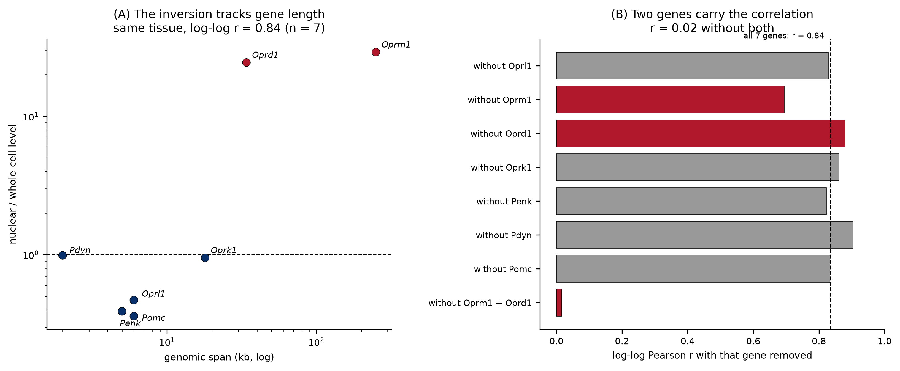
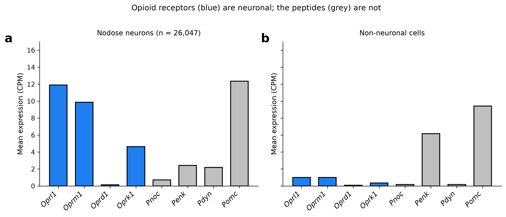
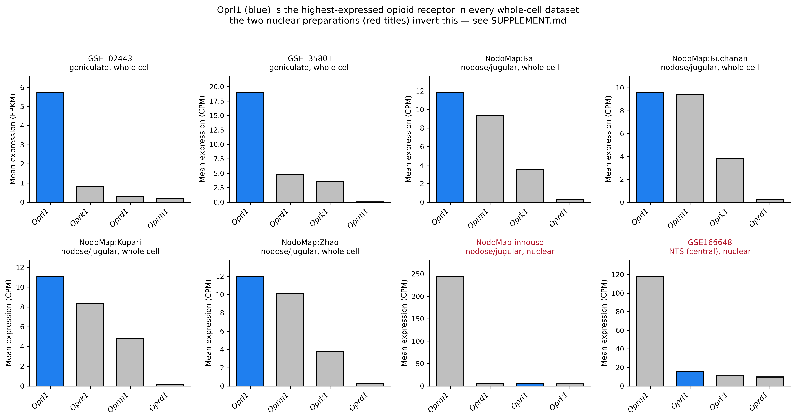
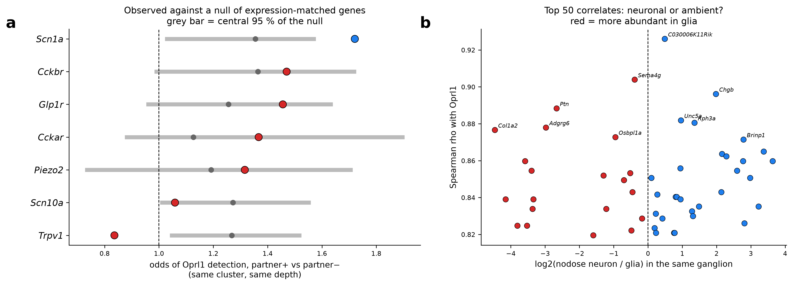
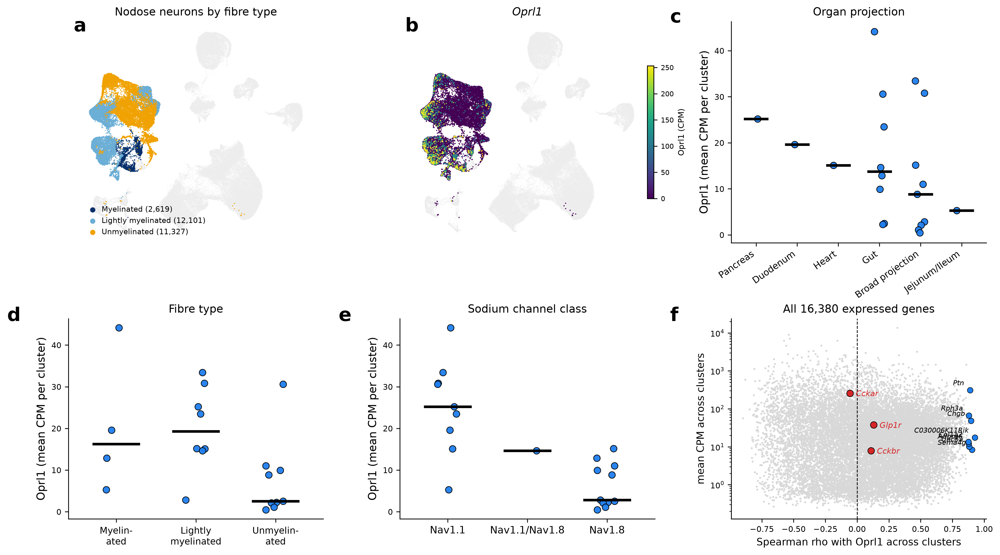
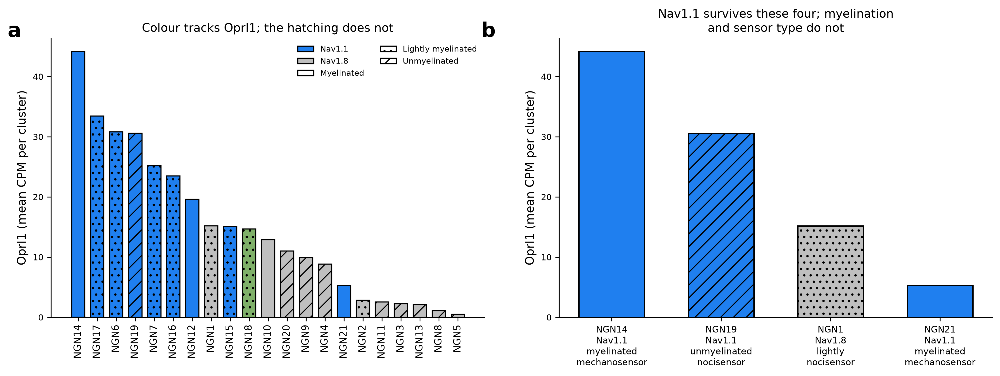

# Supplementary material

These analyses establish which datasets support which claims. They concern data quality rather
than *Oprl1* biology.

---

## Figure S1. Nuclear preparation reverses the opioid receptor ordering

Six of the eight datasets in this atlas are whole-cell and two are single-nucleus. The two nuclear
datasets are also the two that place *Oprm1* above *Oprl1*.

Within the nodose ganglion, where whole-cell and nuclear data exist for the same tissue, the size
of the shift tracks genomic span (`results/nuclear_bias_vs_gene_length.csv`):

| gene | genomic span | nuclear / whole-cell level |
|---|---|---|
| *Oprm1* | 250 kb | 29.0× |
| *Oprd1* | 34 kb | 24.4× |
| *Oprk1* | 18 kb | 0.95× |
| *Oprl1* | 6 kb | 0.47× |
| *Pomc* | 6 kb | 0.36× |
| *Penk* | 5 kb | 0.39× |
| *Pdyn* | 2 kb | 0.99× |

log-log Pearson *r* = 0.84 over 7 genes; Spearman rho = 0.58, *p* = 0.18. Nuclear preparations
retain unspliced pre-mRNA, so genes with long introns gain signal. *Oprm1* spans 250 kb against
*Oprl1*'s 6 kb and gains 29-fold, enough to move it from second to first. Weighting the whole-cell
baseline by cell count rather than by dataset changes little (*Oprm1* 25.4×, *Oprl1* 0.45×).

Two genes carry the correlation. Dropping *Oprm1* and *Oprd1* takes *r* from 0.84 to 0.02
(`results/nuclear_bias_sensitivity.csv`, panel b); the remaining five genes span 2 to 18 kb with
ratios from 0.36 to 0.99 and show no trend. Three further limitations apply:

- *Oprd1*'s 24.4× is a ratio against a 0.22 CPM baseline, where the estimate is unstable.
- Preparation is confounded with laboratory. One nuclear nodose dataset exists (765 neurons,
  in-house) and no in-house whole-cell dataset, so the two variables cannot be separated.
- *Oprm1* detection rises from 5-9% to 71.9% in that dataset. A change of that size in the
  fraction of cells with any read fits an intron-inclusive alignment (`cellranger
  --include-introns`) as well as it fits pre-mRNA retention.

The direction of the effect is reproducible and the mechanism is consistent with the two largest
points. The quantitative relationship across all seven genes is not established.

The inversion reproduces in a second ganglion and a second laboratory. GSE201654 sequenced mouse
dorsal root ganglion nuclei, and the same tissue exists as whole cells in the iPain atlas.
Whole-cell mouse DRG places *Oprl1* first at 9.31 CPM against *Oprm1* 8.23; nuclear mouse DRG
places *Oprm1* first at 94.92 against *Oprl1* 7.60. Two tissues, two laboratories, the same
reversal. Section 9 uses this as the standard against which the human data is read.

Only whole-cell datasets support the receptor comparison in section 1. The two nuclear datasets
are reported and excluded from that claim. GSE166648 is nuclear, so this atlas makes no
peripheral-to-central comparison of receptor ordering.

## Figure S2. The opioid panel in neurons and non-neuronal cells

Mean expression of all eight opioid genes in nodose neurons and in the non-neuronal cells of the
same ganglion, whole-cell datasets only. The four receptors are essentially neuronal. *Penk* runs
in the opposite direction and is largely a fibroblast transcript, which accounts for its negative
neuronal enrichment.

## Figure S3. The four receptors in all eight datasets

The comparison from section 1, extended to every dataset including the two nuclear ones, each
panel in its own unit. *Oprl1* is highest in all six whole-cell datasets. The two nuclear
preparations place *Oprm1* first, for the reason given in figure S1.

## Figure S4. Matched nulls and the ambient-RNA check

Panel a plots every cluster-and-depth-stratified odds ratio in this project against a null built
from around 100 genes matched to that partner on detection rate (within 20%) and mean expression
(within 50%). The grey bar spans the central 95% of the null. The null median lies between 1.13
and 1.36 rather than at 1.0, because *Oprl1* is a relatively high expresser in large
transcriptionally active neurons and capture depth measured in detected features does not capture
cell size. Any observed odds ratio between 1.3 and 1.5 is therefore uninformative. *Scn1a* clears
its null at *p* = 0.0099; *Trpv1* and *Scn10a* fall below theirs.

*Cckar* has 11 matched controls because few genes combine its 33.9% detection rate with 240 CPM,
so its null is the least reliable of the seven.

Panel b scores the top 50 *Oprl1* correlates for neuronal against glial abundance in the same
ganglion. Twenty are more abundant in glia. This pipeline applies no ambient-RNA correction and
NodoMap contains around 50,000 satellite and myelinating glia, so the correlate list carries a
contamination component that the gene of interest does not: *Oprl1* is log2 +3.48 neuron over
glia.

## The ambient check across the atlas

The same comparison now runs on every population that has a non-neuronal compartment to compare
against, 14 of the 21 in `results/dataset_quality_panel.csv`. The remaining seven are deposits of
sorted or author-filtered neurons.

*Oprl1*'s enrichment on its own measures two things at once: how neuronal the transcript is, and
how cleanly the two compartments separated in that dissociation. *Snap25* is neuronal by
definition, so the difference isolates the first. Across the eleven peripheral populations where
both are available, *Oprl1* sits between 0.67 log2 below *Snap25* and 0.58 above it, median −0.14.
The extremes are the sphenopalatine (−0.55) and the superior cervical heart-disease pair (+0.58).

The three populations with the lowest raw *Oprl1* enrichment are the superior cervical untreated
pair (+0.75), the intrinsic cardiac ganglion (+0.75) and the P24 enteric neurons (+0.84). In all
three, *Snap25* is also low (+0.80, +1.29, +1.29), which identifies the cause: the non-neuronal
pool in those preparations contains neurons that failed the positive threshold, so it is not a
clean reference. The difference against *Snap25* is the quantity that survives this, and it is
−0.06, −0.54 and −0.45 there.

*Oprm1* is the more neuron-enriched of the two in four of the eleven, including the coeliac
ganglion (+5.43 against +3.48) and the superior cervical pair (+1.31 against +0.75). Ambient RNA
therefore does not preferentially inflate the receptor that wins, which is what the check was
built to test.

The nuclear NTS preparation sits at −1.28, outside the peripheral range, in the direction figure S1
predicts. *Oprm1* there is +2.34 and *Oprd1* +3.27 against *Oprl1*'s +0.18: the long-intron
receptors gain in nuclei and the 6 kb one does not.

## Figures S5 and S6. The annotation panels behind section 3

*Oprl1* on the NodoMap UMAP by fibre type, the same embedding showing *Oprl1*, cluster-level
distributions for organ projection, fibre type and sodium channel class, and the
transcriptome-wide scan over all 16,380 expressed genes with *Glp1r*, *Cckar* and *Cckbr* marked.

All 21 nodose clusters ranked by *Oprl1*, coloured by sodium channel class and hatched by fibre
type, and the four clusters that separate the two annotations: NGN19 (Nav1.1, unmyelinated
nociceptor, 4th of 21), NGN21 (Nav1.1, myelinated mechanosensor, 17th), NGN1 (Nav1.8, above five
Nav1.1 clusters) and NGN14.

## Stratum granularity

Every odds ratio in this project rises as the stratification coarsens
(`results/vagal_or_stratum_stability.csv`):

| partner | cluster × depth-tercile | cluster × depth-median | cluster only |
|---|---|---|---|
| *Scn1a* | 1.72 | 1.98 | 2.89 |
| *Glp1r* | 1.46 | 1.67 | 2.64 |
| *Cckar* | 1.37 | 1.58 | 2.25 |
| *Piezo2* | 1.32 | 1.53 | 2.40 |

The finest stratification gives the smallest estimate and is what the main text quotes. The
ordering between partners is preserved at every granularity, so *Cckar*'s 51 strata over 26,047
cells (around 510 per stratum) produce a conservative estimate rather than an unstable one.

## The Nav1.1 gradient against matched genes

*Oprl1* CPM and detection rate correlate at rho = 0.95 across clusters, and CPM per detected cell
also rises with detection rate (rho = 0.69), so a cluster gradient could reflect soma size and
total RNA content. Running the same Nav1.1/Nav1.8 cluster-mean ratio for 550 expression-matched
control genes (`results/nav_gradient_matched_null.csv`) gives a matched median of 1.11 against
*Oprl1*'s 4.02, with *Oprl1* exceeding 95.8% of them. A third of the matched genes are themselves
nominally significant at *p* < 0.05, which is the size of the background this control removes.

## Marker-gene checks

Every dataset passes `check_markers()` before any *Oprl1* number is read from it. *Snap25* and
*Actb* are enforced, and their absence or silence raises `SanityCheckError`. *Phox2b*, *Slc17a6*,
*Tac1* and *Calca* are recorded without being enforced, since they are tissue-specific.

| dataset | *Snap25* | *Phox2b* | *Slc17a6* | *Tac1* | *Calca* | *Actb* |
|---|---|---|---|---|---|---|
| GSE102443 (FPKM) | 2742.4 | 39.8 | 65.0 | 417.0 | 98.0 | 413.4 |
| GSE135801 (CPM) | 1707.6 | 777.0 | 295.6 | 453.2 | 35.1 | 1229.3 |
| GSE166648 neurons (CPM) | 890.2 | 30.9 | 83.2 | 29.1 | 17.1 | 242.2 |

Full tables are in `results/*_marker_checks.csv`.

## Detection rate across platforms

*Oprl1* is detected in 92% of geniculate neurons on full-length SMART-seq and in 9% of nodose
neurons on 10x droplet data. That difference measures platform sensitivity. No claim in this
repository compares detection rates across assays. Detection is compared within one dataset only,
between clusters of the same atlas sequenced together.

The co-expression analyses in the main text report depth-stratified odds ratios rather than
overlap percentages for the same reason: raw co-detection between two sparsely detected genes is
dominated by per-cell capture depth.

## Bootstrap support for the receptor ordering

`bootstrap_receptor_support()` resamples cells with replacement 10,000 times and reports how often
the observed top receptor stays top (`results/*_rank_support.csv`). This appears in the main
README because it qualifies the section 1 claim: NodoMap:Buchanan places *Oprl1* first by 1.8% and
holds that ordering in 56% of resamples.

The count was raised from 2,000. Four of the ten supports sit between 0.89 and 0.98, where 2,000
resamples left the third decimal unstable between runs. Raising it also widened the interval on
the GSE135801 margin from 1.04-34.9 to 0.99-36.7, so that interval now includes 1: the geniculate
replication establishes the ordering without constraining the size of the lead.

## Genes checked and not reported

*Calcr* is detected in no nodose neuron in the whole-cell NodoMap data. *Gfral* (5 cells) and
*Gipr* (19 cells) are too sparse for an odds ratio, as are the jugular *Glp1r* (31) and *Cckbr*
(7) rows. The reporting threshold is 100 partner-positive cells. *Pnoc* is absent from the
GSE102443 annotation and is recorded as unmeasured rather than as zero wherever it appears.
